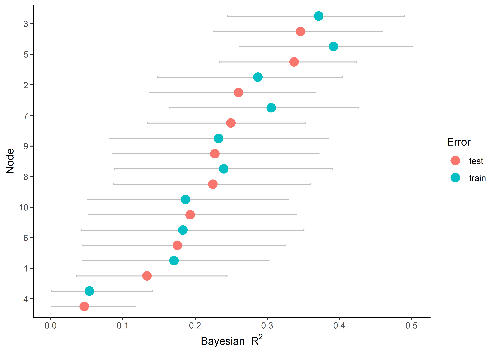
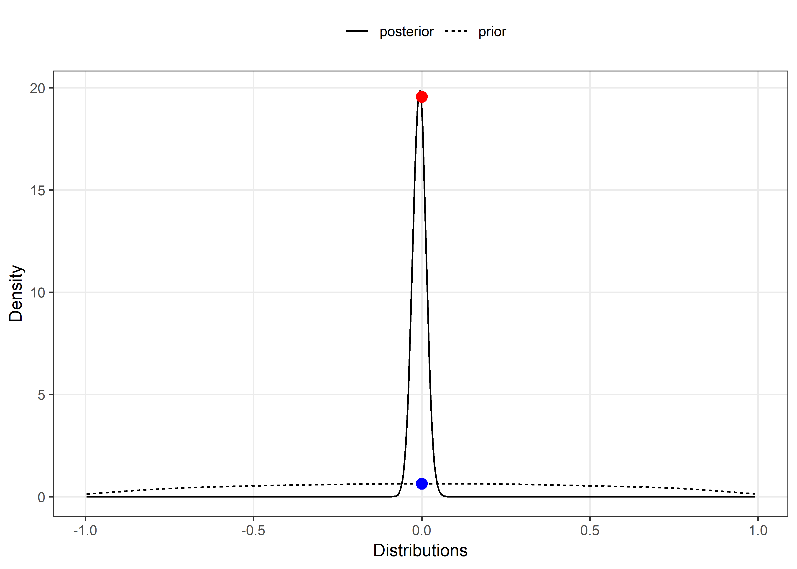
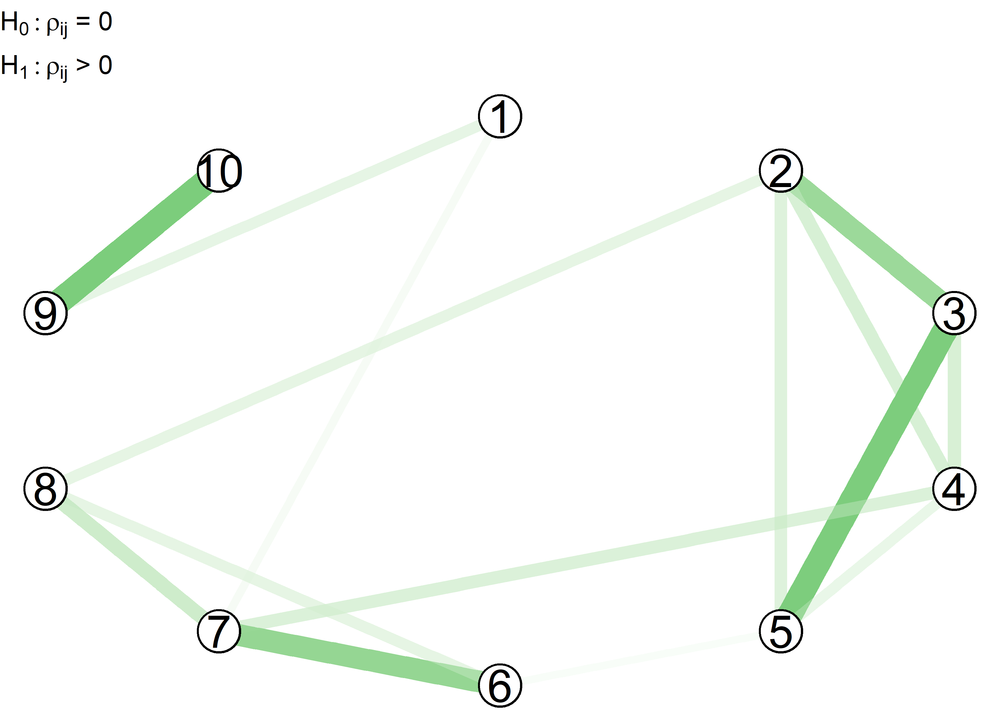
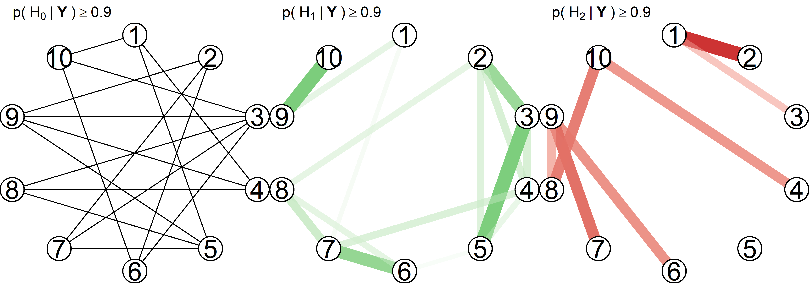
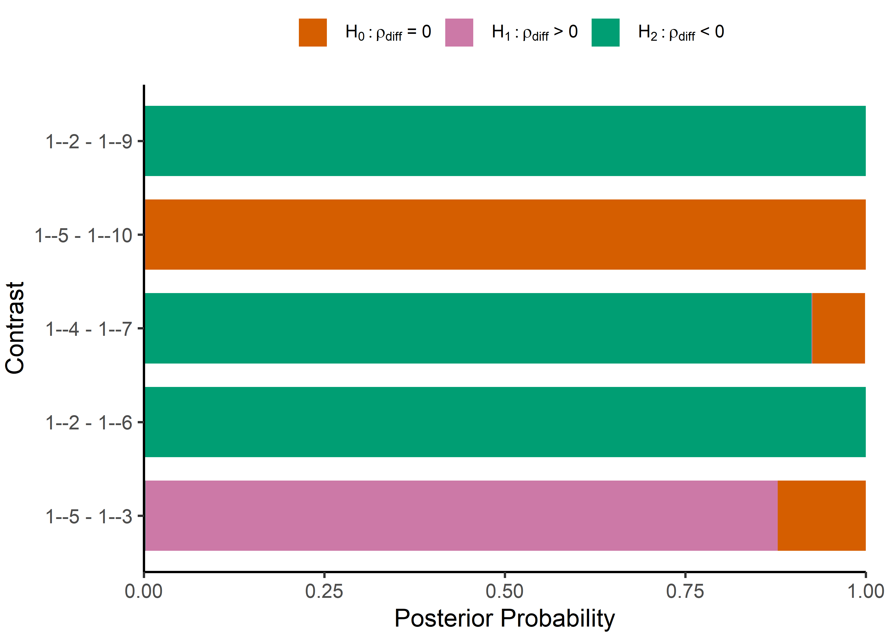
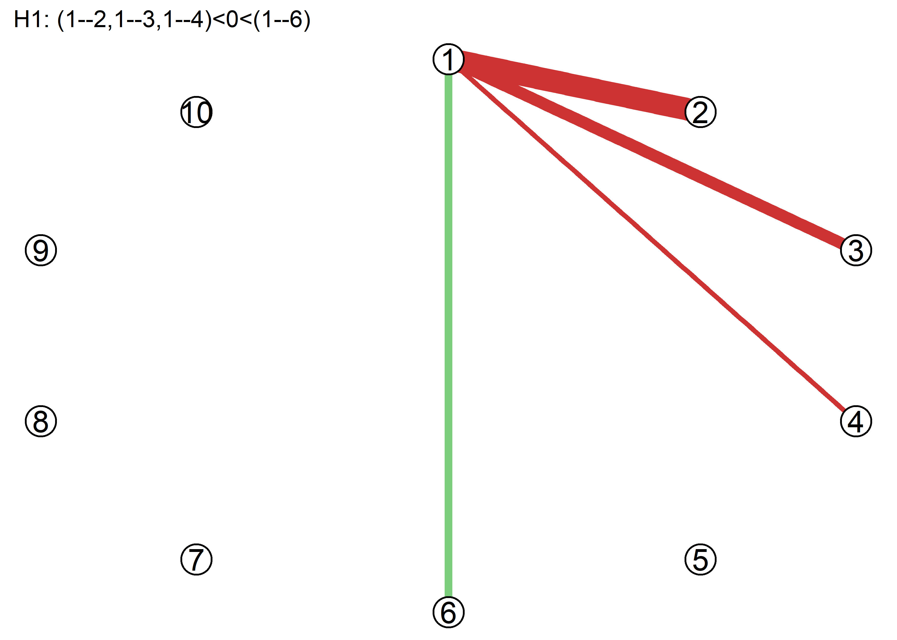
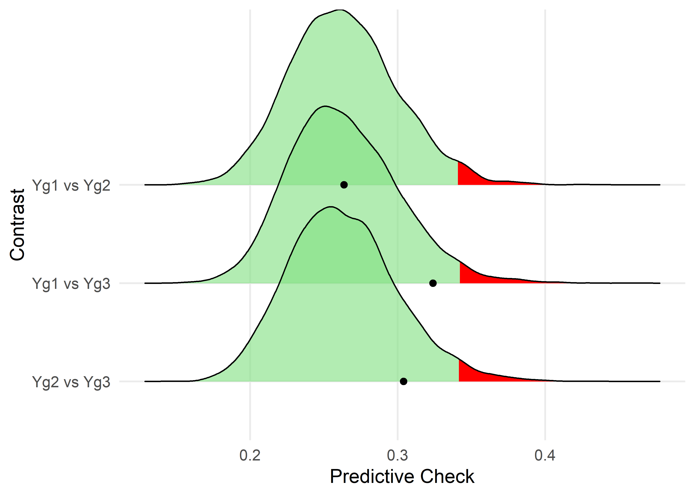
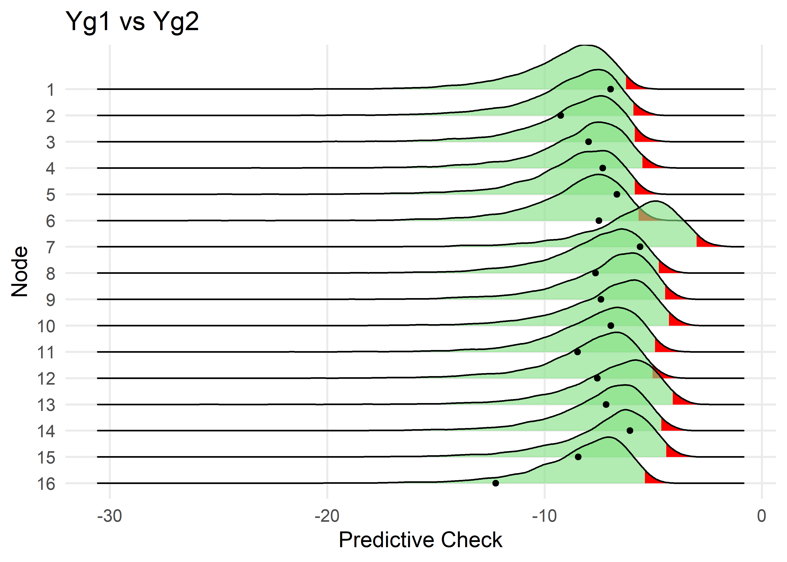

<!-- README.md is generated from README.Rmd. Please edit that file -->


This package includes methods introduced in Williams, Rast, Pericchi, and Mulder (2019), Williams and Mulder (2019), and Williams (2018). The package is built around two Bayesian approaches for inference: estimation and hypothesis testing.

The estimation based methods are described in Williams (2018). They offer advantages compared to classical methods, in that a measure of uncertainty is provided for all parameters. For example, each node has a distribution for variance explained (i.e., Bayesian *R*<sup>2</sup>). Measures of out-of-sample prediction error are available, which also have a measure of uncertainty. The model is selected with credible interval exclusion of zero or a region of practical equivalence. This allows for computing the posterior probability for an assumed *null* region--i.e., conditional independence. It is also possible to compare partial correlations.

The hypothesis testing based methods are described in Williams and Mulder (2019), and allow for testing edges (i.e., partial correlations) with the Bayes factor. One-sided hypothesis testing is also possible. These methods provide (relative) evidence for the null hypothesis. There are extensions for **confirmatory hypothesis testing** in GGMs--e.g., inequality or equality constraints on the partial correlations. This allows for comparing theoretically informed models with Bayesian model selection.

Further, it is possible to assess differences as well as similarities (i.e., the null hypothesis) between GGMs. These method were introduced in Williams, Rast, Pericchi, and Mulder (2019). Graphs are compared either with the posterior predictive distribution or Bayesian model selection. The latter allows for testing hypothesized changes in graphical structures between, for example, control and treatment groups. The posterior predictive approach is based on KL-divergence. It allows for testing the assumed (null) model of group equality for the entire graph or specific variables. These methods can be used to compare any number of GGMs.

Williams, D. R. (2018). Bayesian Inference for Gaussian Graphical Models: Structure Learning, Explanation, and Prediction. ([pre-print](https://doi.org/10.31234/osf.io/x8dpr))

Williams, D. R., & Mulder, J. (2019). Bayesian Hypothesis Testing for Gaussian Graphical Models:Conditional Independence and Order Constraints. ([pre-print](https://doi.org/10.31234/osf.io/ypxd8))

Williams, D. R., Rast, P., Pericchi, L. R., & Mulder, J. (2019). Comparing Gaussian Graphical Models with the Posterior Predictive Distribution and Bayesian Model Selection. ([pre-print](https://psyarxiv.com/yt386/))

Outline
-------

This README is organized as follows:

-   [Installation](#installation)

-   [Estimation](#estimation)

    -   [Structure Learning (Estimation)](#structure-learning-estimation)

    -   [Edge Differences (Estimation)](#edge-differences)

    -   [Prediction](#prediction)

        -   [Bayesian *R*<sup>2</sup>](#bayesian-r2)

        -   [Leave-One-Out Cross-Validation](#leave-one-out-cross-validation)

-   [Hypothesis Testing](#hypothesis-testing)

    -   [Structure Learning (Bayes Factor)](#structure-learning-bayes-factor)

        -   [Visualizing Scientific Expectations](#visualizing-scientific-expectations)

        -   [Two-Sided Hypothesis Testing](#two-sided-testing)

        -   [One-Sided Hypothesis Testing](#one-sided-testing)

        -   [Exhaustive Hypothesis Testing](#exhaustive-hypothesis-testing)

    -   [Edge Differences (Hypothesis Testing)](#edge-differences-hypothesis-testing)

    -   [Confirmatory Hypothesis Testing](#confirmatory-hypothesis-testing)

        -   [Order Constraints](#order-constraints)

        -   [Equality Constraints](#equality-constraints)

-   [Comparing GGMs](#comparing-ggms)

    -   [Posterior Predictive KL Divergence](#posterior-predictive-kl-divergence)

    -   Bayesian Model Selection

Installation
============

You can install BGGM from git hub with:

``` r
# install.packages("devtools")
devtools::install_github("donaldRwilliams/BGGM")
```

Estimation
==========

The following methods are described in Williams (2018). They build upon two basic ideas. First, the Wishart distribution is a conjugate prior distribution for the precision matrix (inverse of the covariance matrix). This provides an analytic solution for selecting the graph, and allows for conveniently drawing posterior samples. Second, there is an exact relationship between estimating the precision matrix directly and with multiple regression. Here the individual elements, from joint posterior distribution of the precision matrix, can be converted to their respective regression counterparts. This allows for assessing nodewise (for each variable in the model) predictability.

Structure Learning (Estimation)
-------------------------------

By structure learning we are referring to selecting the graph (i.e., the edge set *E*), which consists of those edges determined to be non-zero. For demonstrative purposes, we consider a relatively small number of variables (*p* = 5).

The package **BGGM** offers a convenient analytic solution for estimating GGMs. It is implemented with:

``` r
library(BGGM)
library(ggplot2)
library(ggraph)
library(foreach)


# p = 5
Y <- BGGM::bfi[,1:5]

# analytic solution
fit_analytic <- estimate(Y, analytic = T)

# summary
summary(fit_analytic)
#> BGGM: Bayesian Gaussian Graphical Models 
#> --- 
#> Type: Estimation (Analytic Solution) 
#> Posterior Samples: 
#> Observations (n): 2709 
#> Variables (p): 5 
#> Edges: 10 
#> --- 
#> Call: 
#> estimate.default(x = Y, analytic = T)
#> --- 
#> Date: Sun Jun 02 10:30:15 2019
```

Note `summary(.)` provides information about the fitted model, including that the analytic solution was used, the number of observations (*n*) and variables (*p*), and the number of edges.

The edge set is then selected with:

``` r
# select the graph (edge set E)
E <- select(fit_analytic, ci_width = 0.95)

# summary of E
summary(E)
#> BGGM: Bayesian Gaussian Graphical Models 
#> --- 
#> Type: Selected Graph (Analytic Solution) 
#> Credible Interval: 95 % 
#> Connectivity: 80 % 
#> --- 
#> Call:
#> select.estimate(x = fit_analytic, ci_width = 0.95)
#> --- 
#> Selected:
#>  
#> Partial correlations 
#>  
#>       1     2     3    4    5
#> 1  0.00 -0.24 -0.11 0.00 0.00
#> 2 -0.24  0.00  0.29 0.16 0.16
#> 3 -0.11  0.29  0.00 0.18 0.36
#> 4  0.00  0.16  0.18 0.00 0.12
#> 5  0.00  0.16  0.36 0.12 0.00
#> --- 
#>  
#> Adjacency 
#>  
#>   1 2 3 4 5
#> 1 0 1 1 0 0
#> 2 1 0 1 1 1
#> 3 1 1 0 1 1
#> 4 0 1 1 0 1
#> 5 0 1 1 1 0
#> ---
```

The analytic solution works directly with the precision matrix, and thus, there is not an option to summarize the posterior distributions. This is because the non-standardized elements are in the opposite direction (±) of the partial correlations, which in our experience, can lead to confusion. To summarize the partial correlations change `analytic = T` to `analytic = F`:

``` r
# sample from posterior
fit_sampling <- estimate(Y, analytic = F)

# select the graph
E <- select(fit_sampling, ci_width = 0.95)

# summarize partial correlations
summary(E, summarize = T, digits = 2)
#> BGGM: Bayesian Gaussian Graphical Models 
#> --- 
#> Type: Selected Graph (Sampling) 
#> Credible Interval: 95 % 
#> Connectivity: 80 % 
#> --- 
#> Call:
#> select.estimate(x = fit_sampling, ci_width = 0.95)
#> --- 
#> Estimates: 
#>  
#>  edge post_mean post_sd   2.5%  97.5%
#>  1--2   -0.2401   0.018 -0.276 -0.204
#>  1--3   -0.1076   0.019 -0.144 -0.069
#>  2--3    0.2867   0.018  0.251  0.321
#>  1--4   -0.0078   0.019 -0.045  0.030
#>  2--4    0.1643   0.019  0.128  0.199
#>  3--4    0.1778   0.019  0.141  0.215
#>  1--5   -0.0088   0.019 -0.046  0.028
#>  2--5    0.1566   0.019  0.120  0.192
#>  3--5    0.3586   0.017  0.326  0.392
#>  4--5    0.1214   0.019  0.084  0.159
#> ---
```

Note that `edge` corresponds to that particular entry in the partial correlation matrix--i.e., `1--2` is the relation between the first and second variables, respectively.

**BGGM** provides several options for plotting, with each implemented as a S3 generic. For example, the partial correlations can be plotted with:

``` r
# p = 10
Y <- BGGM::bfi[,1:10]

# sampling required
fit_sampling <- estimate(Y, analytic = F)

# plot
plot_1A <- plot(fit_sampling, 
                ci_width = 0.95, 
                width = 0.1,  
                size = 2) +
            coord_cartesian() +
            theme(axis.text.x = element_text(angle = 90))
  
plot_1A
```


This example nicely demonstrates how the `plot` objects can be further customized with **ggplot2**. There are two options for visualizing the selected graph. The heatmap plot is generated with:

``` r
# select the graph
E <- select(fit_sampling, ci_width = 0.95)

# heatmap plot
plot_1B <- plot(E, 
                type = "heatmap", 
                lower_tri = TRUE) +
           ggtitle("Heatmap Plot") + 
           theme(plot.title = element_text(size = 15))
```

Here `lower_tri = TRUE` controls which partial correlations are plotted. In this case, only the lower triangular elements are included in the plot. This can be changed with `lower_tri = FALSE`.

On the other hand, a “network” plot can be obtained with:

``` r
# network plot
plot_1C <- plot(E, type = "network",
                layout ='circle',
                node_outer = 8,
                node_inner = 7,
                node_text_size = 4) +
           ggtitle("Network Plot") +
           theme(plot.title = element_text(size = 15))

cowplot::plot_grid(plot_1B, plot_1C)
```


A key feature of **BGGM** is extending inference beyond identifying non-zero partial correlations. The region of practical equivalence can be used for this purpose, as it allows for determining which relations are practically zero. In this case, we follow Cohen’s guidelines, wherein 0.1 is considered a small effect.This is implemented with:

``` r
# p = 10
Y <- BGGM::bfi[,1:10]

# sample from posterior
fit_sample <- estimate(Y, samples = 5000, analytic = F)

# select the graph
E <- select(fit_sample, rope = 0.1, prob = 0.95)
#> ci_width is ignored

# summary for first 10 rows
head(E, nrow = 10, summarize = T, digits = 2)
#> BGGM: Bayesian Gaussian Graphical Models 
#> --- 
#> Type: Selected Graph (Sampling) 
#> Probability: 0.95 
#> Region of Practical Equivalence:[-0.1, 0.1]
#> Connectivity: 31.1 % 
#> --- 
#> Call:
#> select.estimate(x = fit_sample, rope = 0.1, prob = 0.95)
#> --- 
#> pr_out: post prob outside of rope 
#> pr_in: post prob inside of rope 
#> --- 
#> Estimates: 
#>  
#>  edge post_mean post_sd pr_out  pr_in
#>  1--2    -0.244   0.018   1.00 0.0000
#>  1--3    -0.106   0.019   0.61 0.3864
#>  2--3     0.286   0.018   1.00 0.0000
#>  1--4    -0.015   0.019   0.00 1.0000
#>  2--4     0.161   0.019   1.00 0.0006
#>  3--4     0.160   0.019   1.00 0.0006
#>  1--5    -0.017   0.020   0.00 1.0000
#>  2--5     0.145   0.019   0.99 0.0110
#>  3--5     0.354   0.017   1.00 0.0000
#>  4--5     0.114   0.019   0.76 0.2372
#> ---
```

The argument `prob = 0.95` requires that 95 % of the posterior density be in or out of the rope to be considered practically equivalent or different from zero. With this decision rule, as seen with `head(.)`, edges `1--4` and `1--5` are practically equivalent to zero. This inference is made possible with **BGGM**.

In this case, `plot(.)` returns two objects: (1) the selected edges; (2) those for which there is support for the null values. This is implemented with:

``` r
# network plot
plts <- plot(E, type = "network",
             layout ='circle',
             node_outer = 10,
             node_inner = 9,
             node_text_size = 6)

# practically non-zero
plot_1D <- plts$plot_nonzero +
             ggtitle("Practically Non-zero") +
             theme(plot.title = element_text(size = 15))

plot_1D
```


``` r
# practically zero
plot_1E <- plts$plot_zero +
              ggtitle("Practically Zero") +
              theme(plot.title = element_text(size = 15))

plot_1E
```


We emphasize that GGMs are often thought to capture conditionally *independent* relations--i.e., evidence for the null hypothesis of no effect, conditional on the other variables in the model. However, the dominant approach assesses conditional *dependence* (*ρ*<sub>*i**j*</sub> ≠ 0), and then sets relations to zero otherwise. **BGGM** can explicitly answer the question of conditional independence.

Edge Differences
----------------

Differences between partial correlations are often tested in GGMs; for example, with a classical (i.e., frequentist) approach that is implemented in **bootnet**. One contribution of **BGGM** is providing Bayesian analogs for commonly used methods, as well as extensions to those methods. In this case, we can use posterior probabilities to determine which edges are practically equivalent. This is implemented with:

``` r
edge_difference <- edge_compare(fit_sample, 
                                contrast =  list("1--5 - 1--3", 
                                                 "1--2 - 1--6", 
                                                 "1--4 - 1--7", 
                                                 "1--5 - 1--10", 
                                                 "1--2 - 1--9"), 
                                ci_width = 0.95,
                                rope = 0.1)

head(edge_difference, nrow = 4)
#> BGGM: Bayesian Gaussian Graphical Models 
#> --- 
#> Type: Edge comparison(s) 
#> Credible Interval: 95 % 
#> Region of Practical Equivalence:[-0.1, 0.1]
#> --- 
#> Call:
#> edge_compare.estimate(x = fit_sample, contrast = list("1--5 - 1--3", 
#>     "1--2 - 1--6", "1--4 - 1--7", "1--5 - 1--10", "1--2 - 1--9"), 
#>     ci_width = 0.95, rope = 0.1)
#> --- 
#> Estimates: 
#>  
#>      contrast post_mean post_sd pr_out  pr_in
#>   1--5 - 1--3    0.0891  0.0322 0.3644 0.6356
#>   1--2 - 1--6   -0.2964  0.0269      1      0
#>   1--4 - 1--7   -0.0873  0.0294  0.333  0.667
#>  1--5 - 1--10     0.009  0.0268  6e-04 0.9994
#> ---
```

This output includes the posterior mean and standard deviation for each difference. Further, `pr_in` is the proportion of samples between (±) 0.1. This can be interpreted as the posterior probability of practical equivalence, which has been defined with the argument `rope = 0.1`. Note that care must be taken when specifying the contrasts, as an error will arise if they are not in the proper format. The object `edge_difference` can then be plotted, but this is omitted to save space.

<!-- The object `edge_difference` can the be plotted with: -->
<!-- ```{r, out.height= "250 %"} -->
<!-- # plot contrasts -->
<!-- plot_diff <- plot(edge_difference, prob = .99) -->
<!-- # practically different -->
<!-- plot_2A <- plot_diff$plt_nonzero + -->
<!--            ggtitle("Practically Different") + -->
<!--            theme(axis.text.y = element_blank()) -->
<!-- plot_2A -->
<!-- ``` -->
<!-- ```{r, out.height= "250 %"} -->
<!-- # practically equivalent -->
<!-- plot_2B <- plot_diff$plt_zero + -->
<!--   scale_y_continuous(limits = c(-0.4, 0.4)) + -->
<!--   ggtitle("Practically Equivalent") + -->
<!--   theme(axis.text.y = element_blank()) -->
<!-- plot_2B -->
<!-- ``` -->
<!-- This shows the central idea behind the region of practical equivalence, which is highlighted in grey. Ideally only a few contrasts would be examined in light of a guiding theory. To this end, the option `contrast = "all"` may be removed altogether from **BGGM**. -->
Prediction
----------

The following is based on the correspondence between the elements of the precision matrix and multiple regression. In the context of GGMs, using regression to select edges is referred to as “neighborhood” selection. On the other hand, the method described in Williams (2018) works directly with either the posterior distribution for the precision matrix or the maximum a posteriori estimates. These are then converted to the corresponding regression coefficients and residual variances. It follows that **BGGM** can also be used for the purpose of multiple regression–i.e.,

``` r
# p = 10
Y <- BGGM::bfi[,1:10]

# sample posterior
fit <- estimate(Y, samples = 5000)

# precision to regression
coefficients(fit, node = 1, ci_width = 0.95)
#> BGGM: Bayesian Gaussian Graphical Models 
#> --- 
#> Type: Inverse to Regression 
#> --- 
#> Call: 
#> BGGM:::beta_summary(x = fit, node = node, ci_width = ci_width, 
#>     samples = samples)
#> --- 
#> Estimates: 
#>  
#>  node post_mean post_sd   2.5%  97.5%
#>     2    -0.278   0.021 -0.318 -0.236
#>     3    -0.124   0.022 -0.168 -0.082
#>     4    -0.014   0.020 -0.052  0.026
#>     5    -0.018   0.022 -0.059  0.026
#>     6     0.057   0.021  0.016  0.097
#>     7     0.080   0.022  0.039  0.121
#>     8     0.044   0.020  0.004  0.083
#>     9     0.142   0.022  0.101  0.186
#>    10    -0.028   0.021 -0.072  0.012
#> ---
```

Here `node = 1` indicates which node is summarized. This correspondence allows for computing measures of prediction error (or accuracy), including Bayesian *R*<sup>2</sup> and Bayesian leave-one-out cross-validation, each of which has a measure of uncertainty. Furthermore, when a computationally convenient option is desirable, **BGGM** includes an analytic expression for prediction error. This is also known as the predicted residual sums of squares (PRESS).

### Bayesian *R*<sup>2</sup>

In-sample Bayesian *R*<sup>2</sup> is implemented with:

``` r
# training data
Y_train <- BGGM::bfi[1:100,1:10]

# fit to training data
fit_train <- estimate(Y_train, samples = 5000)

# compute Bayes R2
train_R2 <- predict(fit_train,
                    ci_width = 0.90,
                    samples = 1000,
                    measure = "R2")

# summary for first 2 rows
head(train_R2, nrow = 2)
#> BGGM: Bayesian Gaussian Graphical Models 
#> --- 
#> Type: In-sample predictive accuracy 
#> Measure: Variance Explained (R2) 
#> --- 
#> Call:
#> predict.estimate(fit = fit_train, ci_width = 0.9, samples = 1000, 
#>     measure = "R2")
#> --- 
#> Estimates: 
#> 
#>  node post_mean    post_sd       2.5%     97.5%
#>     1 0.1672939 0.06795891 0.04865661 0.3013220
#>     2 0.2878926 0.06854488 0.15332864 0.4127918
#> ---
```

Here `ci_width = 0.90` indicates the decision rule for setting coefficients to zero, and by default, 95 % intervals are used in the summary output. Similarly, out-of-sample Bayesian *R*<sup>2</sup> is computed with:

``` r
# test data
Y_test <-  BGGM::bfi[101:2000,1:10]

# predict test data
test_R2 <- predict(fit_train, ci_width = 0.90,
                   test_data = Y_test,
                   samples = 1000, measure = "R2")
```

The work flow is completed by visualizing Bayesian *R*<sup>2</sup> for each node–i.e.,

``` r
# prior training and test error in the same plot
plt_3A <- plot(x1 = train_R2, x2 =  test_R2, order = "test")

plt_3A
```



Here the nodes have been ordered by which has the best out-of-sample performance. It is also possible to have each in a separate plot by leaving `x2` empty. The `predict` object can be used to assess differences in predictive accuracy with compare(.). **BGGM** also includes mean squared error (`measure = "mse"`).

### Leave-one-out cross-validation

Bayesian leave-one-out cross-validation is implemented with:

``` r
# p = 10
Y <- BGGM::bfi[1:1000,1:10]

# sample posterior
fit_sample <- estimate(Y, samples = 5000)

# Bayesian LOO
bayes_loo <- loocv(fit_sample)

# nodewise loo summary
summary(bayes_loo)
#> BGGM: Bayesian Gaussian Graphical Models 
#> --- 
#> Type: Leave-One-Out Prediction Error (Bayesian) 
#> --- 
#> Call:
#> loocv.default(x = fit_sample)
#> --- 
#> Estimates: 
#> 
#>   node      loo   loo_se
#>     1 2572.881 48.79147
#>     2 2330.954 63.41761
#>     3 2302.254 63.91730
#>     4 2466.945 52.04912
#>     5 2416.291 55.62011
#>     6 2435.181 58.61647
#>     7 2299.964 50.38408
#>     8 2389.603 51.28087
#>     9 2294.588 51.50263
#>    10 2363.693 39.75391
#> ---
```

The results are plotted with:

``` r
# plot CV error
plt_3B <- plot(bayes_loo, size = 8) +
          theme_classic() +
          ylab("Bayesian Leave-One-Out")

plt_3B
```


Similarly, by setting `analytic = T`, leave-one-out prediction error can be computed analytically. This is implemented with:

``` r
# p = 10
Y <- BGGM::bfi[1:1000,1:10]

# analytic solution
fit_analytic <- estimate(Y, analytic = T)

# analytic LOO (PRESS; based on point estimates)
press_loo <- loocv(fit_analytic)

# plot CV error
plt_3C <- plot(press_loo, size = 8) +
          theme_classic() +
          ylab("PRESS: Leave-One-Out") +
          scale_y_continuous(expand = c(0, 0),
          limit = c(0, 1000))

plt_3C
```


This highlights the difference between the leave-one-out methods, in that the Bayesian version has a measure of uncertainty (although the order is the same). For both measures of predictive *error*, a lower value indicates a more predictable node (variable).

Hypothesis Testing
==================

The following methods were introduced in Williams and Mulder (2019). That work not only presented an exploratory approach using the Bayes factor, but it also proposed methodology for confirmatory hypothesis testing in GGMs. The latter provides an alternative to data driven model selection that is commonplace in the GGM literature, and in particular, it allows for comparing theoretical models. Further, the novel matrix−*F* prior distribution is used for the partial correlations, which offers more flexibility than the Wishart distribution. This approach builds upon (Mulder2016), where the focus was on correlations (as opposed to *partial* correlations). In particular, **BGGM** allows for Bayesian model selection with competing sets of inequality and/or equality constraints on multiple partial correlations.

Structure Learning (Bayes Factor)
---------------------------------

### Visualizing Scientific Expectations

For Bayesian hypothesis testing in particular, it is important to *fully* understand the prior distribution ℋ<sub>*u*</sub>. This is because it captures the predicted effect size, and it is used to compute the Bayes factor. This stands in contrast to the above estimation based methods, where *E* is determined with respect to (only) the posterior distribution. To this end, **BGGM** includes functions to visualize the prior distribution or prediction--i.e.,

``` r
# define (potentially) hypothesized standard deviations for rho_ij
rho_sd <- c(0.1, 0.25, 0.5)

# plot
plt_4A <- hypothesis_plot(rho_sd = rho_sd) +
                theme(panel.grid.major = element_blank()) +
                ylab("Density")        

plt_4A
```


`rho_sd = c(.)` defines a couple (prospective) values for the hypothesized standard deviation of the partial correlations. Further, **BGGM** allows for testing edge differences with the Bayes factor. Accordingly, the *implied* prior distribution for the difference can also be visualized. This is implemented with:

``` r
# define (potentially) hypothesized standard deviations for rho_ij
rho_sd <- c(0.1, 0.25, 0.5)

# plot
plt_4B <- hypothesis_plot(rho_sd = rho_sd,
                          difference = TRUE) +
                theme(panel.grid.major = element_blank()) +
                ylab("Density")        

plt_4B
```


### Two-Sided Testing

Two-sided hypothesis testing is implemented as follows. First the model is fitted with:

``` r
# p = 5
Y <- BGGM::bfi[,1:5]

# fit model
fit_bf <- explore(Y, prior_sd = 0.5, 
                  iter = 5000, 
                  cores = 2)
summary(fit_bf)
#> BGGM: Bayesian Gaussian Graphical Models 
#> --- 
#> Type: Hypothesis Testing (Exploratory) 
#> Posterior Samples: 5000 
#> Observations (n): 2709 
#> Variables (p): 5 
#> Edges: 10 
#> Delta: 3 
#> --- 
#> Call: 
#> explore.default(X = Y, prior_sd = 0.5, iter = 5000, cores = 2)
#> --- 
#> Date: Sun Jun 02 10:30:40 2019
```

Note `summary(.)`, or alternatively `print(.)`, provides information about the fitted model, including that hypothesis testing (exploratory) was used, the number of observations (*n*) and variables (*p*), and the number of edges. Delta (*δ*) is the hyperparameter of the matrix−*F* distribution. A value of 3 corresponds to `prior_sd = 0.5`. This output parallels the estimation based methods. Importantly, all fitted objects include specific (what method was used) and general information (e.g., *n* and *p*) when printed.

The graph is then selected with:

``` r
E <- select(fit_bf, 
            BF_cut = 3, 
            alternative = "two.sided")

# summary 
summary(E, hyp = "H1")
#> BGGM: Bayesian Gaussian Graphical Models 
#> --- 
#> Type: Hypothesis Testing 
#> Alternative: two.sided 
#> Bayes Factor: 3 
#> Connectivity: 80 % 
#> --- 
#> Call:
#> select.explore(x = fit_bf, BF_cut = 3, alternative = "two.sided")
#> --- 
#> Hypothesis: 
#> H1: rho != 0 
#> --- 
#> Partial Correlations 
#>  
#>            1          2          3         4         5
#> 1  0.0000000 -0.2395956 -0.1081094 0.0000000 0.0000000
#> 2 -0.2395956  0.0000000  0.2859901 0.1644763 0.1565290
#> 3 -0.1081094  0.2859901  0.0000000 0.1776020 0.3585515
#> 4  0.0000000  0.1644763  0.1776020 0.0000000 0.1217991
#> 5  0.0000000  0.1565290  0.3585515 0.1217991 0.0000000
#> --- 
#>  
#> Adjancency (non-zero) 
#>  
#>   1 2 3 4 5
#> 1 0 1 1 0 0
#> 2 1 0 1 1 1
#> 3 1 1 0 1 1
#> 4 0 1 1 0 1
#> 5 0 1 1 1 0
#> ---
```

It is also possible to change `hyp = "H1"` to `hyp = "H0`, which will print the adjacency matrix for conditionally independent relations. Further, it is possible to summarize *E* as follows:

``` r
summary(E, summarize = T, log = T, digits = 2)
#> BGGM: Bayesian Gaussian Graphical Models 
#> --- 
#> Type: Hypothesis Testing 
#> Alternative: two.sided 
#> Bayes Factor: 3 
#> --- 
#> Call:
#> select.explore(x = fit_bf, BF_cut = 3, alternative = "two.sided")
#> --- 
#> Hypotheses: 
#> H0: rho = 0
#> H1: rho != 0 
#> --- 
#> Estimates: 
#>  
#>   edge post_mean post_sd BF 10
#>  1--2   -0.2396   0.018  77.2
#>  1--3   -0.1081   0.019  12.5
#>  2--3    0.2860   0.018 112.6
#>  1--4   -0.0080   0.019  -3.5
#>  2--4    0.1645   0.019  32.8
#>  3--4    0.1776   0.019  39.7
#>  1--5   -0.0087   0.019  -3.5
#>  2--5    0.1565   0.019  29.6
#>  3--5    0.3586   0.017 180.4
#>  4--5    0.1218   0.019  17.2
#> --- 
#> note: BF_10 is evidence in favor of H1
```

The option `log = TRUE` controls the scale of the Bayes factor. Note that the same plotting options available for these methods. They have the same implementation as the estimation based methods, and thus the `alternative = two.sided` plot is not shown here. It is also possible to plot ℋ<sub>*u*</sub> and a selected posterior distribution. This visualizes how the Bayes factor is computed--i.e.,

``` r
plt_4C <- hypothesis_plot(fit = fit_bf, 
                edge = "1--4", size = 3) +
        theme(panel.grid.minor = element_blank(),
              legend.position = "top") +
  ylab("Density") +
  xlab("Distributions")


plt_4C
```



Here it can be seen that the Bayes factor is the ratio of density evaluated at 0. In this case, there is evidence for ℋ<sub>0</sub> (*B**F*<sub>01</sub> ≈ 33). This plotting option may be useful for understanding (and describing) the Bayes factor approach for selecting the graph (or more generally the testing strategy for partial correlations).

### One-Sided Testing

One-sided hypothesis testing is implemented with:

``` r
# p =  10
Y <- BGGM::bfi[,1:10]

# sample from posterior
fit_bf <- explore(Y, prior_sd = 0.5, 
                  iter = 5000, 
                  cores = 2)

# rho > 0
E_pos <- select(fit_bf, 
            BF_cut = 3, 
            alternative = "greater")

# positive plot
plt_pos <- plot(E_pos, type = "network") 
plt_pos <- plt_pos$plot_nonzero + 
           ggtitle(expression(atop(H[0]: rho[i][j]*" = "*0, H[1]: rho[i][j]*" > "*0))) 

plt_pos
```



ℋ<sub>1</sub> : *ρ*<sub>*i**j*</sub> &lt; 0 can be tested by changing `alternative = greater` to `alternative = less`.

### Exhaustive Hypothesis Testing

A defining feature of Bayesian hypothesis testing is the ability to assess which theoretical model best predicts the data at hand. However, in the absence of guiding theory, it is likely that a more exploratory approach is warranted. **BGGM** thus includes an exhaustive approach--i.e.,ℋ<sub>0</sub> : *ρ*<sub>*i**j*</sub> = 0 vs. ℋ<sub>1</sub> : *ρ*<sub>*i**j*</sub> &gt; 0 vs. ℋ<sub>2</sub> : *ρ*<sub>*i**j*</sub> &lt; 0.

This covers the entire parameter space. Further details can be found in Williams and Mulder (2019). The exhaustive approach is implemented with:

``` r
# p = 10
Y <- BGGM::bfi[,1:10]

# sample from posterior
fit_bf <- explore(Y, prior_sd = 0.5, 
                  iter = 5000, 
                  cores = 2)
# select the graph
E <- select(fit_bf, 
            hyp_prob = 0.90, 
            alternative = "exhaustive")

# first 5 rows
head(E, summarize = T, nrow = 5)
#> BGGM: Bayesian Gaussian Graphical Models 
#> --- 
#> Type: Hypothesis Testing 
#> Alternative: exhaustive 
#> Posterior probability: 0.9 
#> --- 
#> Call:
#> select.explore(x = fit_bf, alternative = "exhaustive", hyp_prob = 0.9)
#> --- 
#> Hypotheses: 
#> H0: rho = 0
#> H1: rho > 0
#> H2: rho < 0 
#> --- 
#> Estimates: 
#>  
#>   edge  post_mean    post_sd p(H0|Y) p(H1|Y) p(H2|Y)
#>  1--2 -0.2434351 0.01835940   0.000   0.000   1.000
#>  1--3 -0.1059906 0.01914992   0.000   0.000   1.000
#>  2--3  0.2867937 0.01801402   0.000   1.000   0.000
#>  1--4 -0.0143457 0.01948303   0.997   0.001   0.002
#>  2--4  0.1609401 0.01913710   0.000   1.000   0.000
#> ---
```

The ratio of posterior probabilities, e.g., *p*(ℋ<sub>1</sub>|**Y**)/*p*(ℋ<sub>2</sub>|**Y**), can then be used to compute a Bayes factor if desired. `hyp_prob = 0.90` is the decision rule for concluding there is evidence for a given hypothesis. This can the be plotted with:

``` r
# plots
plts <- plot(E, type = "network")

# combine
cowplot::plot_grid(plts$plot_H0, plts$plot_H1, plts$plot_H2, nrow = 1)
```


Edge Differences (Hypothesis Testing)
-------------------------------------

**BGGM** allows for testing edge differences with Bayesian hypothesis testing. The same options are available as for determining *E*--i.e., `alternative = "two.sided"`, `alternative = "greater"` (or less), and `alternative = "exhaustive"`. The exhaustive approach is implemented with:

``` r
# p = 10
Y <- BGGM::bfi[,1:10]

# sample from posterior
fit_bf <- explore(Y, prior_sd = 0.5, 
                  iter = 5000, 
                  cores = 2)
# edge compare
edge_comp <- edge_compare(fit_bf, 
                  contrast = c("1--5 - 1--3", 
                               "1--2 - 1--6", 
                               "1--4 - 1--7", 
                               "1--5 - 1--10", 
                               "1--2 - 1--9"), 
                  alternative = "exhaustive")
# summary
summary(edge_comp)
#> BGGM: Bayesian Gaussian Graphical Models 
#> --- 
#> Type: Edge comparison (Hypothesis Testing)
#> Alternative: exhaustive 
#> --- 
#> Call:
#> edge_compare.explore(x = fit_bf, contrast = c("1--5 - 1--3", 
#>     "1--2 - 1--6", "1--4 - 1--7", "1--5 - 1--10", "1--2 - 1--9"), 
#>     alternative = "exhaustive")
#> --- 
#> Hypotheses: 
#> H0: rho = 0
#> H1: rho > 0
#> H2: rho < 0 
#> --- 
#> Estimates: 
#>  
#>       contrast    post_mean    post_sd p(H0|Y) p(H1|Y) p(H2|Y)
#>   1--5 - 1--3  0.090054512 0.03136732   0.110   0.888   0.002
#>   1--2 - 1--6 -0.296464016 0.02635283   0.000   0.000   1.000
#>   1--4 - 1--7 -0.087675734 0.02924543   0.068   0.001   0.931
#>  1--5 - 1--10  0.009800605 0.02638408   0.998   0.001   0.001
#>   1--2 - 1--9 -0.368038081 0.02604811   0.000   0.000   1.000
#> ---
```

There are two plotting options for the returned object `edge_comp`. The first is ideal if few contrasts are tested--i.e.,

``` r
# plot
plt <- plot(edge_comp, stack = F, spread = .75)

# one contrast
plt$`1--5 - 1--3`
```



The object `plt` includes a separate plot for each contrast. On the other hand, in the case of many contrasts, it is also possible to visualize each with a stacked bar chart--i.e.,

``` r
# plot
plt <- plot(edge_comp, stack = T, spread = .75)

# stacked
plt
```



Confirmatory Hypothesis Testing
===============================

A key contribution of **BGGM** is extending hypothesis testing beyond exploratory and to confirmatory in GGMs. The former is essentially feeding the data to the functions in **BGGM** and seeing what comes back. In other words, there are no specific, hypothesized models under consideration. On the other hand, the confirmatory hypothesis testing approaches allows for comparing theoretical models or (actual) predictions. The focus is thus not on *E*, but only certain edges in the network.

Order Constraints
-----------------

Theory may suggest, for example, that a set of partial correlations is expected to be larger than another set of partial correlations, that there is a hypothesized order of edge magnitude for a given node (variable), or some edges are expected to be positive while others are predicted to be negative. These can be tested with **BGGM**.

For example, suppose we expected (predicted) the following:

ℋ<sub>1</sub> : *ρ*<sub>1, 2</sub> &gt; *ρ*<sub>1, 3</sub> &gt; *ρ*<sub>1, 4</sub> &gt; *ρ*<sub>1, 5</sub>

vs.

ℋ<sub>*c*</sub>: Not ℋ<sub>1</sub>

This is implemented with:

``` r
# p = 10
Y <- BGGM::bfi[,1:10]
# hypothesis
hypothesis <- c("1--2 > 1--3 > 1--4 > 1--5")
# test order
test_order <-  confirm(x = Y, hypothesis  = hypothesis, 
                       prior_sd = 0.5, iter = 50000, 
                       cores = 2)
# summary
summary(test_order)
#> BGGM: Bayesian Gaussian Graphical Models 
#> --- 
#> Type: Confirmatory Hypothesis Testing 
#> --- 
#> Call:
#> confirm.default(x = Y, hypothesis = hypothesis, prior_sd = 0.5, 
#>     iter = 50000, cores = 2)
#> --- 
#> Hypotheses: 
#>                        
#>  H1 1--2>1--3>1--4>1--5
#>  Hc            'not H1'
#> --- 
#> Posterior prob: 
#>             
#>  p(H1|Y) = 0
#>  p(Hc|Y) = 1
#> --- 
#> Bayes factor matrix: 
#>    H1          Hc
#> H1  1 2.56472e+20
#> Hc  0 1.00000e+00
#> --- 
#> note: equal hypothesis prior probabilities
```

As indicated by the posterior probabilities, the hypothesis was not supported.

One the other hand, we can also test the prediction that, for a specific variable (for example), certain edges are negative while others are positive--i.e.,

ℋ<sub>1</sub> : (*ρ*<sub>1, 2</sub>, *ρ*<sub>1, 3</sub>, *ρ*<sub>1, 4</sub>)&lt;0 &lt; *ρ*<sub>1, 6</sub>

vs.

ℋ<sub>*c*</sub>: Not ℋ<sub>1</sub>

Here the prediction states that the relation between variable 1 and 6 is positive, whereas the others are predicted to be negative. This is implemented with:

``` r
# hypothesis
hypothesis <- c("(1--2, 1--3, 1--4)  <  0 < (1--6)")
# test order
test_order <-  confirm(x = Y, hypothesis  = hypothesis, 
                       prior_sd = 0.5, iter = 50000, 
                       cores = 2)
# summary
summary(test_order)
#> BGGM: Bayesian Gaussian Graphical Models 
#> --- 
#> Type: Confirmatory Hypothesis Testing 
#> --- 
#> Call:
#> confirm.default(x = Y, hypothesis = hypothesis, prior_sd = 0.5, 
#>     iter = 50000, cores = 2)
#> --- 
#> Hypotheses: 
#>                              
#>  H1 (1--2,1--3,1--4)<0<(1--6)
#>  Hc                  'not H1'
#> --- 
#> Posterior prob: 
#>                  
#>  p(H1|Y) = 0.9798
#>  p(Hc|Y) = 0.0202
#> --- 
#> Bayes factor matrix: 
#>       H1    Hc
#> H1  1.00 0.021
#> Hc 48.59 1.000
#> --- 
#> note: equal hypothesis prior probabilities
```

There is strong support for ℋ<sub>1</sub>. Note that `iter = 50000` (≈7 seconds), which ensures an adequate number of samples for accurately computing the Bayes factor. Although the focus is not *E*, but rather a subset of partial correlations, the object `test_order` can be plotted--i.e.,

``` r
plt <- hypothesis_plot(fit = test_order, 
                node_outer = 8, 
                node_inner = 7, 
                node_text_size = 6)
plt
#> [[1]]
```



This is meant to highlight the specific edges considered in the hypothesis test. Further, in this plot, it is clear that (*ρ*<sub>1, 2</sub>, *ρ*<sub>1, 3</sub>, *ρ*<sub>1, 4</sub>)&lt;0 and that 0 &lt; *ρ*<sub>1, 6</sub>. We emphasize that these *confirmatory* hypotheses should be decided upon before visualizing the network.

Equality Constraints
--------------------

**BGGM** can also test exact equality constraints on sets of edges (i.e., partial correlations). One could predict that certain edges have the same strength (effect size) or that a set of edges are equal to zero. The latter allows for testing expectations about the underlying conditional independence structure, say, for a particular variable (node) in the model. For example,

ℋ<sub>1</sub> : (*ρ*<sub>1, 2</sub>, *ρ*<sub>1, 3</sub>, *ρ*<sub>1, 4</sub>)=0

vs.

ℋ<sub>*c*</sub>: Not ℋ<sub>1</sub>

``` r
hypothesis <- "(1--2, 1--3, 1--4) = 0"

# test order
test_order <-  confirm(x = Y, hypothesis  = hypothesis, 
                       prior_sd = 0.5, iter = 50000, 
                       cores = 2)
# summary
summary(test_order)
#> BGGM: Bayesian Gaussian Graphical Models 
#> --- 
#> Type: Confirmatory Hypothesis Testing 
#> --- 
#> Call:
#> confirm.default(x = Y, hypothesis = hypothesis, prior_sd = 0.5, 
#>     iter = 50000, cores = 2)
#> --- 
#> Hypotheses: 
#>                       
#>  H1 (1--2,1--3,1--4)=0
#>  Hc           'not H1'
#> --- 
#> Posterior prob: 
#>             
#>  p(H1|Y) = 0
#>  p(Hc|Y) = 1
#> --- 
#> Bayes factor matrix: 
#>    H1           Hc
#> H1  1 2.223996e+56
#> Hc  0 1.000000e+00
#> --- 
#> note: equal hypothesis prior probabilities
```

Comparing GGMs
==============

**BGGM** includes two approaches for comparing any number of GGMs. They were introduced in Williams, Rast, Pericchi, and Mulder (2019). The methods can test entire structures, particular edges, and nodewise testing. One approach is based on the posterior predictive distribution, and tests the null hypothesis of group equality. Importantly, like classical methods (i.e., frequentist), this approach can only determine whether the null of group equality is rejected or retained. It cannot provide evidence for the null hypothesis. To this end, another approach is based on Bayesian model selection. This allows for assessing network invariances (i.e., the null hypothesis).

Posterior Predictive KL Divergence
----------------------------------

The predictive approach is based on the distribution of future data. In particular, the posterior predictive distribution of Kullback–Leibler divergence is used to test the null hypothesis of group equality. This method can be understood as a multivariate likelihood ratio that accounts for uncertainty, but importantly, with respect to the predictive distribution.

``` r
# Assume null is true
Y1 <- MASS::mvrnorm(500, rep(0, 16), Sigma = BGGM::ptsd_cor1)
Y2 <- MASS::mvrnorm(500, rep(0, 16), Sigma = BGGM::ptsd_cor1)
Y3 <- MASS::mvrnorm(500, rep(0, 16), Sigma = BGGM::ptsd_cor1)

# predictive check
ggm_ppc1 <- ggm_compare_ppc(Y1, Y2, Y3, 
                           type = "global", iter = 5000)
# summary
summary(ggm_ppc1)
#> BGGM: Bayesian Gaussian Graphical Models 
#> --- 
#> Type: GGM Comparison (Global Predictive Check) 
#> --- 
#> Call: 
#> ggm_compare_ppc.default(Y1, Y2, Y3, type = "global", iter = 5000)
#> --- 
#> Estimates: 
#>  
#>      contrast       KLD p_value
#>  Y_g1 vs Y_g2 0.3087305  0.1130
#>  Y_g1 vs Y_g3 0.2588864  0.5188
#>  Y_g2 vs Y_g3 0.2200615  0.8990
#> --- 
#> note: 
#> p_value = p(T(Y_rep) > T(y)|Y)
#> KLD = Kullback–Leibler divergence
```

In this case, the null hypothesis was not rejected. The `p_value` is the probability, or proportion, that the predictive KL divergence is larger than the observed KL divergence. For example, with `p_value = 0.02` (e.g.), this would indicate that, conditional on group equality, there is only a 2 % chance of observing that amount of error in the future. Thus this would be considered extreme at the conventional threshold (*α* = 0.05).

The above example tested the entire network (`type = global`). It is also possible to narrow the focus to each node in the GGM. In other words, the null hypothesis of group equality is tested for each variable. This predictive check is implemented with:

``` r
# Assume null is true
Y1 <- MASS::mvrnorm(500, rep(0, 16), Sigma = BGGM::ptsd_cor1)
Y2 <- MASS::mvrnorm(500, rep(0, 16), Sigma = BGGM::ptsd_cor1)

# predictive check
ggm_ppc2 <- ggm_compare_ppc(Y1, Y2, type = "nodewise", iter = 5000)
# summary
summary(ggm_ppc2)
#> BGGM: Bayesian Gaussian Graphical Models 
#> --- 
#> Type: GGM Comparison (Nodewise Predictive Check) 
#> --- 
#> Call: 
#> ggm_compare_ppc.default(Y1, Y2, type = "nodewise", iter = 5000)
#> --- 
#> Estimates: 
#>  
#> contrast: Y_g1 vs Y_g2 
#> 
#>  node   KLD p_value
#>     1 0.001  0.1118
#>     2 0.000  0.6680
#>     3 0.000  0.4488
#>     4 0.001  0.3456
#>     5 0.001  0.1390
#>     6 0.001  0.3532
#>     7 0.004  0.5148
#>     8 0.000  0.5760
#>     9 0.001  0.6194
#>    10 0.001  0.5452
#>    11 0.000  0.6968
#>    12 0.001  0.5150
#>    13 0.001  0.6068
#>    14 0.002  0.2656
#>    15 0.000  0.7590
#>    16 0.000  0.9384
#> 
#> --- 
#> note: 
#> p_value = p(T(Y_rep) > T(y)|Y)
#> KLD = Kullback–Leibler divergence
```

The predictive distributions can also be visualized. For example, the `global` check is implemented with:

``` r
# global predictive check
plot(ggm_ppc1) +
  theme_minimal(base_size = 14)  +
  theme(legend.position = "none",  panel.grid.minor.x = element_blank())
```



The `nodewise` predictive check is plotted with:

``` r
#plots
plot(ggm_ppc2, log = T)[[1]] +
  theme_minimal(base_size = 14)  +
  theme(legend.position = "none",  panel.grid.minor.x = element_blank())
```


