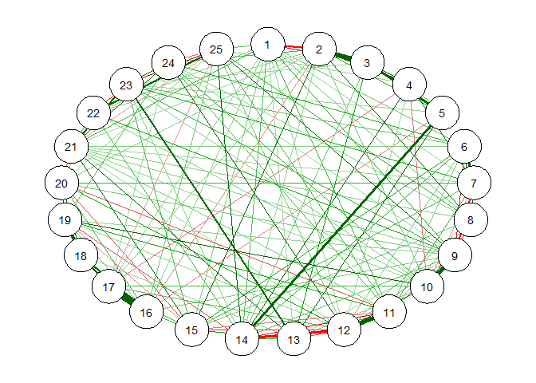
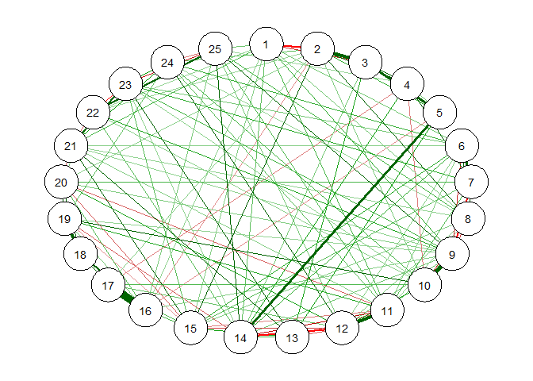
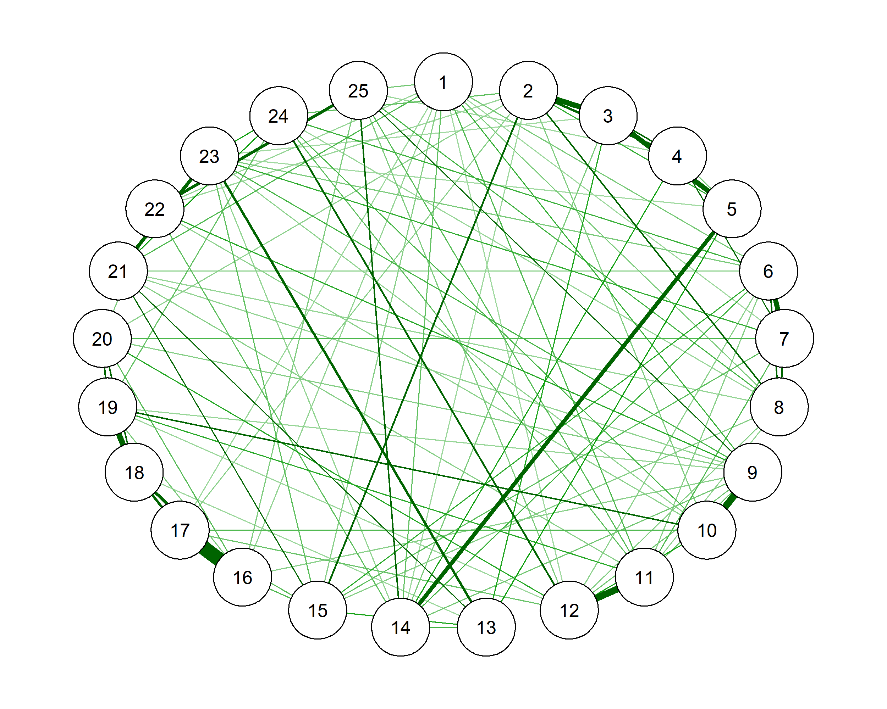
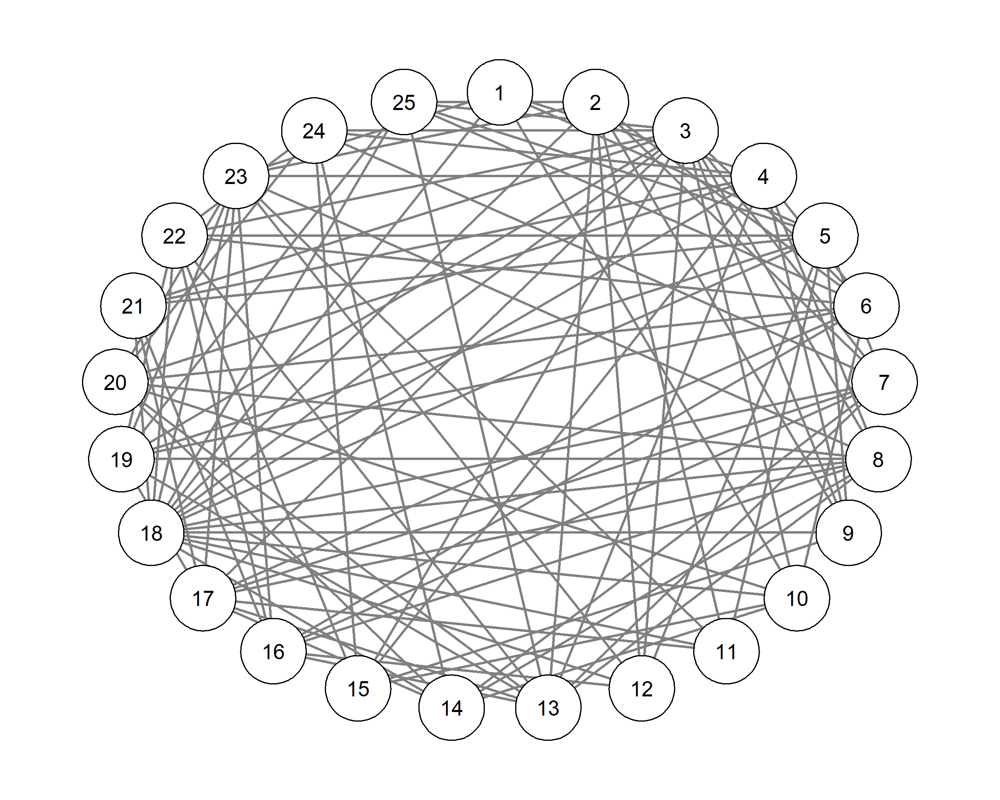

<!-- README.md is generated from README.Rmd. Please edit that file -->
BGGM
====

This package is described in Williams and Mulder (2019) and Williams (2018). The methods are separated into two Bayesian approaches for inference: hypothesis testing and estimation. The former is described in Williams and Mulder (2018a), and allows for testing for the presence of edges with the Bayes factor. One-sided hypothesis testing is also possible. These methods can also provide evidence for the null hypothesis. There are extensions for confirmatory hypothesis testing in GGMs, that can include inequality or equality constraints on the partial correlations.

The estimation based methods are described in Williams (2018). The methods offer advantages compared to classical methods, in that a measure of uncertainty is provided for all parameters. For example, each node has a distribution for the variance explained (i.e., Bayesian *R*<sup>2</sup>). Measures of out-of-sample performance are also available, which also have a measure of uncertainty. The model is selected with credible interval exclusion of zero.

Williams, D. R. (2018, September 20). Bayesian Inference for Gaussian Graphical Models: Structure Learning, Explanation, and Prediction. ([pre-print](https://doi.org/10.31234/osf.io/x8dpr))

Williams, D. R., & Mulder, J. (2019, January 14). Bayesian Hypothesis Testing for Gaussian Graphical Models:Conditional Independence and Order Constraints. ([pre-print](https://doi.org/10.31234/osf.io/ypxd8))

Installation
------------

You can install BGGM from git hub with:

``` r
# install.packages("devtools")
devtools::install_github("donaldRwilliams/BGGM")
```

Example
-------

### Exploratory Hypothesis Testing

These methods allow for gaining evidence for both conditional dependence (*ρ* ≠ 0) and independence (*ρ* = 0). Note that GGMs are often thought to characterize conditional independence structures, but evidence for the null hypothesis of no effect is not (typically) assessed. The following uses the Bayes factor to assess evidence for the null vs. alternative hypothesis.

``` r
library(BGGM)
dat <- BGGM::bfi

# fit the exploratory approach
fit <- BGGM::bayes_explore(X = dat)

# select the network (threshold of 3)
select_graph <- BGGM::explore_select(fit, 
                                     threshold = 3, 
                                     type = "two_sided")
qgraph::qgraph(select_graph$partial_mat)
```



Some of the methods rely on sampling, so we found it most convenient to select the model after fitting-thus changing the threshold does not require refitting the model. This particular method does not require sampling from the prior or posterior distributions, but does rely on assuming normality. In the paper, Williams and Mulder (2019), it was shown these approximations performed well: the Bayes factor was consistent for model selection and invariant to the scale of the data. Sampling is possible for those not happy-and have some patience-with the normal approximation.

``` r
# select the network (threshold of 10)
select_graph <- BGGM::explore_select(fit, 
                                     threshold = 10, 
                                     type = "two_sided")
qgraph::qgraph(select_graph$partial_mat)
```



It is likely that there is an expected direction. That is, maybe it does not make theoretical sense to have negative effects. At this time it is only possible to assume all relations are in the same direction, but this will be changed soon. One-sided hypothesis testing can be performed as follows:

``` r
# select the network (threshold of 10; one-sided)
select_graph <- BGGM::explore_select(fit, 
                                     threshold = 10, 
                                     type = "greater_than")
qgraph::qgraph(select_graph$partial_mat)
```



Note that all the effects are now positive (i.e., the color green).

To date, the conditional independence structure of personality has not been directly assessed. Let us examine for which relations there is evidence for the null hypothesis.

``` r
# select the network (threshold of 3; two-sided)
select_graph <- BGGM::explore_select(fit, 
                                     threshold = 3, 
                                     type = "two_sided")
qgraph::qgraph(select_graph$BF_null_adj, layout = "circle")
```



We are currently thinking of ways to plot the conditional independence structure (open to suggestions), but for now are using only the adjacency matrix.

Finally, for those interested in the substantive aspect of these networks, please see the **psych** package for the variable descriptions.

### Bayesian R-squared

There is a direct correspondence between the precision matrix, that is the inverse of the covariance matrix, and multiple regression. The details are provided ([here](https://donaldrwilliams.github.io/post/2019-10-1-r-markdown/)). Rather than fit a sequence of regression models (i.e., neighborhood selection), as in the R package [GGMnonreg](https://github.com/donaldRwilliams/GGMnonreg), it is possible to only estimate the precision matrix and then transform the elements to their respective regression counterparts. This approach is described in Williams (2018).

With the regression coefficients in-hand, it is then possible to compute *R*<sup>2</sup> for each node in the network. Similar approaches are sometimes used in the social-behavioral sciences. Here the GGMs are often estimated with ℓ<sub>1</sub>-regularization and the reported *R*<sup>2</sup> is a point estimate. This is problematic, because it can be misleading to note that one node has higher *R*<sup>2</sup> than another when there is not a measure of uncertainty. The present methods overcome this limitation with Bayesian *R*<sup>2</sup> that is described ([here](http://www.stat.columbia.edu/~gelman/research/unpublished/bayes_R2.pdf))

JAGS will need to be installed to estimate this model ([link](https://sourceforge.net/projects/mcmc-jags/files/))

The following code fits the model, then selects the graph, and finally computes Bayesian *R*<sup>2</sup> conditional on the fitted model:

``` r
# fit the model
fit <- BGGM::bayes_estimate(dat)

# select the graph
select <- BGGM::estimate_select(fit, ci_width = .99)

# Bayesian R2
r2 <- BGGM::bayes_R2(fit = fit, ci_width = .99, 
               selected = select$adjacency_mat, 
               samples = 500)
```

|     |  post\_mean|   post\_sd|       0.5%|      99.5%|
|-----|-----------:|----------:|----------:|----------:|
| A1  |   0.1767016|  0.0159124|  0.1373595|  0.2142345|
| A2  |   0.3919014|  0.0147482|  0.3555315|  0.4277212|
| A3  |   0.4247237|  0.0160517|  0.3828288|  0.4619725|
| A4  |   0.2938094|  0.0183540|  0.2485219|  0.3351594|
| A5  |   0.3741748|  0.0179158|  0.3255494|  0.4195448|
| C1  |   0.2809184|  0.0168896|  0.2345826|  0.3234448|
| C2  |   0.3621744|  0.0145532|  0.3217681|  0.3960621|
| C3  |   0.2529893|  0.0156885|  0.2161154|  0.2919030|
| C4  |   0.3861281|  0.0149336|  0.3455471|  0.4221855|
| C5  |   0.3616609|  0.0173941|  0.3214110|  0.4030931|
| E1  |   0.3561308|  0.0146115|  0.3189728|  0.3960974|
| E2  |   0.4324890|  0.0160518|  0.3903357|  0.4722081|
| E3  |   0.4048774|  0.0149578|  0.3609459|  0.4393714|
| E4  |   0.4443058|  0.0148561|  0.4059519|  0.4800768|
| E5  |   0.3238932|  0.0180396|  0.2735098|  0.3653599|
| N1  |   0.5948297|  0.0087822|  0.5732075|  0.6168393|
| N2  |   0.5334384|  0.0125834|  0.4941341|  0.5649206|
| N3  |   0.4703463|  0.0124241|  0.4407522|  0.4984730|
| N4  |   0.4247019|  0.0168976|  0.3809173|  0.4676981|
| N5  |   0.3074240|  0.0183800|  0.2603691|  0.3505870|
| O1  |   0.2443120|  0.0159369|  0.2015653|  0.2836741|
| O2  |   0.1971164|  0.0151157|  0.1598589|  0.2375019|
| O3  |   0.3168011|  0.0143951|  0.2767166|  0.3491280|
| O4  |   0.1617073|  0.0142415|  0.1290707|  0.2000124|
| O5  |   0.2165251|  0.0150597|  0.1779080|  0.2571017|

Note that the R package mgm can also compute *R*<sup>2</sup>, but only provides point estimates. It would be possible to apply the bootstrap. However, then *R*<sup>2</sup> would not be conditional on the fitted model and posterior distributions but instead would capture sampling variability.

The package BGGM can also plot the results:

``` r
plot_r2 <- BGGM::predictive_plot(r2, 
                                 size = 2, 
                                 color = "blue")
plot_r2
```


