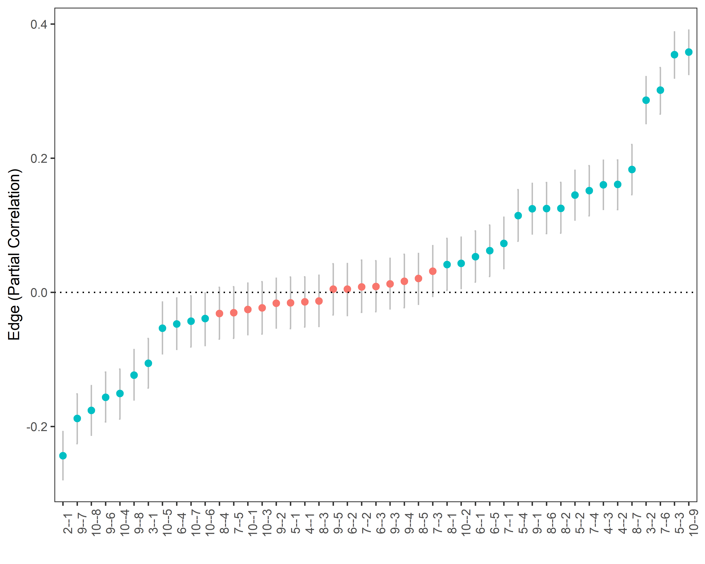
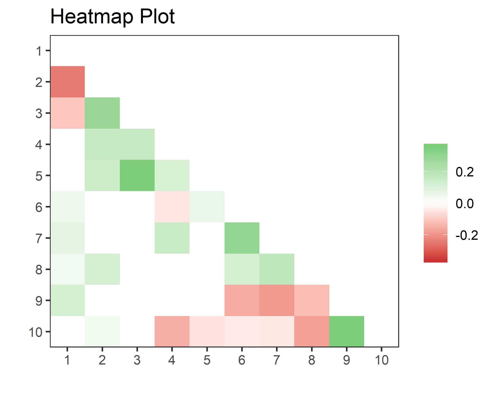
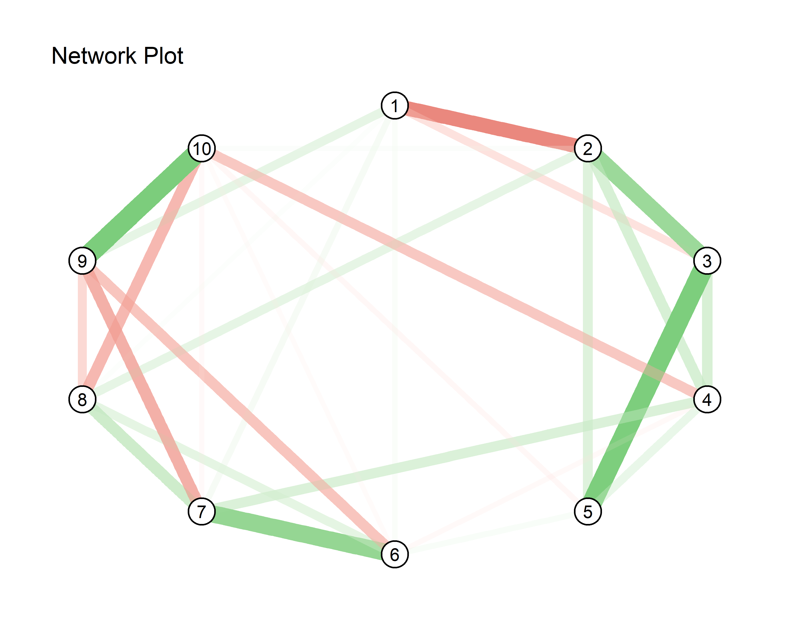

<!-- README.md is generated from README.Rmd. Please edit that file -->
BGGM
====

This package is described in Williams and Mulder (2019) and Williams (2018). The methods are separated into two Bayesian approaches for inference: hypothesis testing and estimation. The former is described in Williams and Mulder (2018a), and allows for testing for the presence of edges with the Bayes factor. One-sided hypothesis testing is also possible. These methods can also provide evidence for the null hypothesis. There are extensions for confirmatory hypothesis testing in GGMs, that can include inequality or equality constraints on the partial correlations.

The estimation based methods are described in Williams (2018). The methods offer advantages compared to classical methods, in that a measure of uncertainty is provided for all parameters. For example, each node has a distribution for the variance explained (i.e., Bayesian *R*<sup>2</sup>). Measures of out-of-sample performance are also available, which also have a measure of uncertainty. The model is selected with credible interval exclusion of zero.

Williams, D. R. (2018, September 20). Bayesian Inference for Gaussian Graphical Models: Structure Learning, Explanation, and Prediction. ([pre-print](https://doi.org/10.31234/osf.io/x8dpr))

Williams, D. R., & Mulder, J. (2019, January 14). Bayesian Hypothesis Testing for Gaussian Graphical Models:Conditional Independence and Order Constraints. ([pre-print](https://doi.org/10.31234/osf.io/ypxd8))

Installation
------------

You can install BGGM from git hub with:

``` r
# install.packages("devtools")
devtools::install_github("donaldRwilliams/BGGM")
```

1. Estimation
-------------

### 1.1 Structure Learning

The package **BGGM** offers a convenient analytic solution for estimating GGMs. It is implemented with:

``` r
# load pacakges
# install.packages("devtools")
# devtools::install_github("donaldRwilliams/BGGM")
library(BGGM)
library(ggplot2)
library(ggraph)

# p = 5
Y <- BGGM::bfi[,1:5]

# analytic solution
fit_analytic <- estimate(Y, analytic = T)
summary(fit_analytic)
#> BGGM: Bayesian Gaussian Graphical Models 
#> --- 
#> Type: Estimation (Analytic Solution) 
#> Posterior Samples: 
#> Observations (n): 2709 
#> Variables (p): 5 
#> Edges: 10 
#> --- 
#> Call: 
#> estimate.default(x = Y, analytic = T)
#> --- 
#> Date: Sat May 11 19:13:12 2019
```

Note provides information about the fitted model, including that the analytic solution was used, the number of observations (*n*) and variables (*p*), and the number of edges.

The edge set is then selected with:

``` r
E <- select(fit_analytic, ci_width = 0.95)
summary(E)
#> BGGM: Bayesian Gaussian Graphical Models 
#> --- 
#> Type: Selected Graph (Analytic Solution) 
#> Credible Interval: 95 % 
#> Connectivity: 80 % 
#> --- 
#> Call:
#> select.estimate(x = fit_analytic, ci_width = 0.95)
#> --- 
#> Selected:
#>  
#> Partial correlations 
#>  
#>       1     2     3    4    5
#> 1  0.00 -0.24 -0.11 0.00 0.00
#> 2 -0.24  0.00  0.29 0.16 0.16
#> 3 -0.11  0.29  0.00 0.18 0.36
#> 4  0.00  0.16  0.18 0.00 0.12
#> 5  0.00  0.16  0.36 0.12 0.00
#> --- 
#>  
#> Adjacency 
#>  
#>   1 2 3 4 5
#> 1 0 1 1 0 0
#> 2 1 0 1 1 1
#> 3 1 1 0 1 1
#> 4 0 1 1 0 1
#> 5 0 1 1 1 0
#> ---
```

The analytic solution works directly with the precision matrix, and thus, there is not an option to summarize the posterior distributions. This is because the non-standardized elements are in the opposite direction (±) of the partial correlations, which in our experience, can lead to confusion. To summarize the posteriors change `analytic = T` to `analytic = F`:

``` r
fit_sampling <- estimate(Y, analytic = F)
E <- select(fit_sampling, ci_width = 0.95)
summary(E, summarize = T, digits = 2)
#> BGGM: Bayesian Gaussian Graphical Models 
#> --- 
#> Type: Selected Graph (Sampling) 
#> Credible Interval: 95 % 
#> Connectivity: 80 % 
#> --- 
#> Call:
#> select.estimate(x = fit_sampling, ci_width = 0.95)
#> --- 
#> Estimates: 
#>  
#>  egde post_mean post_sd   2.5%  97.5%
#>  1--2   -0.2409   0.018 -0.276 -0.205
#>  1--3   -0.1070   0.019 -0.143 -0.070
#>  2--3    0.2864   0.018  0.251  0.321
#>  1--4   -0.0071   0.019 -0.045  0.030
#>  2--4    0.1642   0.019  0.127  0.200
#>  3--4    0.1781   0.019  0.142  0.213
#>  1--5   -0.0091   0.019 -0.046  0.027
#>  2--5    0.1564   0.019  0.120  0.194
#>  3--5    0.3590   0.017  0.325  0.392
#>  4--5    0.1212   0.019  0.084  0.158
#> ---
```

Note that `edge` corresponds to that particular entry in the partial correlation matrix--i.e., `1--2` is the relation between the first and second variables, respectively.

**BGGM** provide several options for plotting, with each implemented as a S3 generic. For example, the partial correlations can be plotted with:

``` r
# p = 10
Y <- BGGM::bfi[,1:10]

# sampling required
fit_sampling <- estimate(Y, analytic = F)

# plot
plot_1A <- plot(fit_sampling, 
                ci_width = 0.95, 
                width = 0.1,  
                size = 2) +
            coord_cartesian() +
            theme(axis.text.x = element_text(angle = 90))
  
plot_1A
```



This example nicely demonstrates how the `plot` objects can be further customarized with **ggplot2**. There are two options for visualizing the selected graph. The heatmap plot is generated with:

``` r
# select the graph
E <- select(fit_sampling, ci_width = 0.95)

plot_1B <- plot(E, 
                type = "heatmap", 
                lower_tri = TRUE) +
           ggtitle("Heatmap Plot") + 
           theme(plot.title = element_text(size = 15))
plot_1B
```



On the other hand, a “network” plot can be obtained with:

``` r
plot_1C <- plot(E, type = "network", 
                layout ='circle',
                node_outer = 8,
                node_inner = 7,
                node_text_size = 4) +
           ggtitle("Network Plot") +
           theme(plot.title = element_text(size = 15))
plot_1C
```


