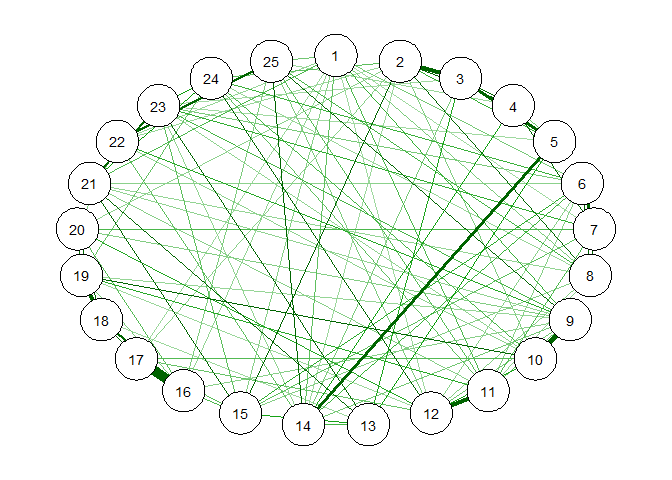
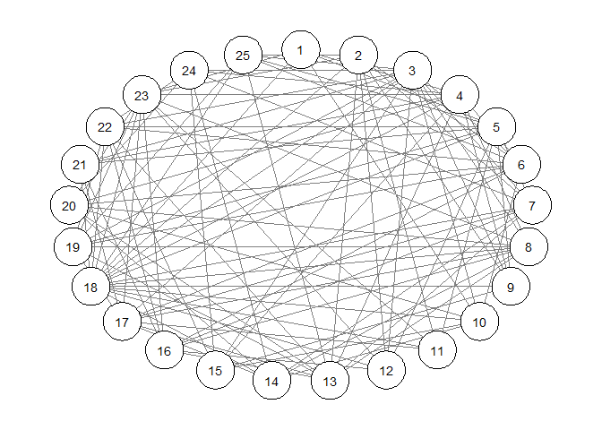

<!-- README.md is generated from README.Rmd. Please edit that file -->
BGGM
====

This package is described in Williams and Mulder (2019) and Williams (2018). The methods are seperated into two Bayesian approaches for inference: hypothesis testing and estimation. The former is described in Williams and Mulder (2018a), and allows for testing for the presence of edges with the Bayes factor. One-sided hypothesis testing is also possible. These methods can also provide evidence for the null hypothesis. There are extensions for confirmatory hypothesis testing in GGMs, that can include inequality or equality contraints on the partial correlation.

The estimation based method are described in Williams (2018). The methods offer advantages compared to classical methods, in that a measure of uncertainty is provided for all parameters. For example, each node has a distribution for the variance explained. Measures of out-of-sample performance are also available. The model is selected with credible interval exclusion of zero.

Williams, D. R. (2018, September 20). Bayesian Inference for Gaussian Graphical Models: Structure Learning, Explanation, and Prediction. [pre-print](https://doi.org/10.31234/osf.io/x8dpr)

Williams, D. R., & Mulder, J. (2019, January 14). Bayesian Hypothesis Testing for Gaussian Graphical Models:Conditional Independence and Order Constraints. [pre-print](https://doi.org/10.31234/osf.io/ypxd8)

Installation
------------

You can install BGGM from github with:

``` r
# install.packages("devtools")
devtools::install_github("donaldRwilliams/BGGM")
```

Example
-------

### Hypothesis Testing

These methods allow for gaining evidence for both conditional depedence (*ρ* ≠ 0) and independence (*ρ* = 0). Note that GGMs are often thought to characterize conditional independece structures, but evidence for the null hypothesis of no effect is not (typically) assessed.

``` r
dat <- BGGM::bfi

# fit the exploratory approach
fit <- BGGM::bayes_explore(X = dat)

# select the network (threshold of 3)
select_graph <- BGGM::explore_select(fit, threshold = 3, type = "two_sided")
qgraph::qgraph(select_graph$partial_mat)
```


Some of the methods rely on sampling, so we found it most convenient to select the model after fitting-thus changing the threshold does not require refitting the model.

``` r
# select the network (threshold of 10)
select_graph <- BGGM::explore_select(fit, threshold = 10, type = "two_sided")
qgraph::qgraph(select_graph$partial_mat)
```


It is likely that there is an expected direction. That is, maybe it does not make theoretical sense to have negative effects. At this time it is only possible to assume all relations are in the same direction, but this will be changed soon. One-sided hypothesis testing can be perfomed as follows:

``` r
# select the network (threshold of 10; one-sided)
select_graph <- BGGM::explore_select(fit, threshold = 10, type = "greater_than")
qgraph::qgraph(select_graph$partial_mat)
```



Note that all the effects are now positive (i.e., the color green).

To date, the conditional independence structure of personality has not been directly assesed. Let us examine for which relations there is evidence for the null hypothesis.

``` r
# select the network (threshold of 10; one-sided)
select_graph <- BGGM::explore_select(fit, threshold = 3, type = "two_sided")
qgraph::qgraph(select_graph$BF_null_adj, layout = "circle")
```



We are currently thinking of ways to plot the conditional independence structure (open to suggestions), but for now are using only the adjacency matrix. Further, for those interested in the substantive aspect of these networks, please see the **psyche** package for the variable descriptions.
