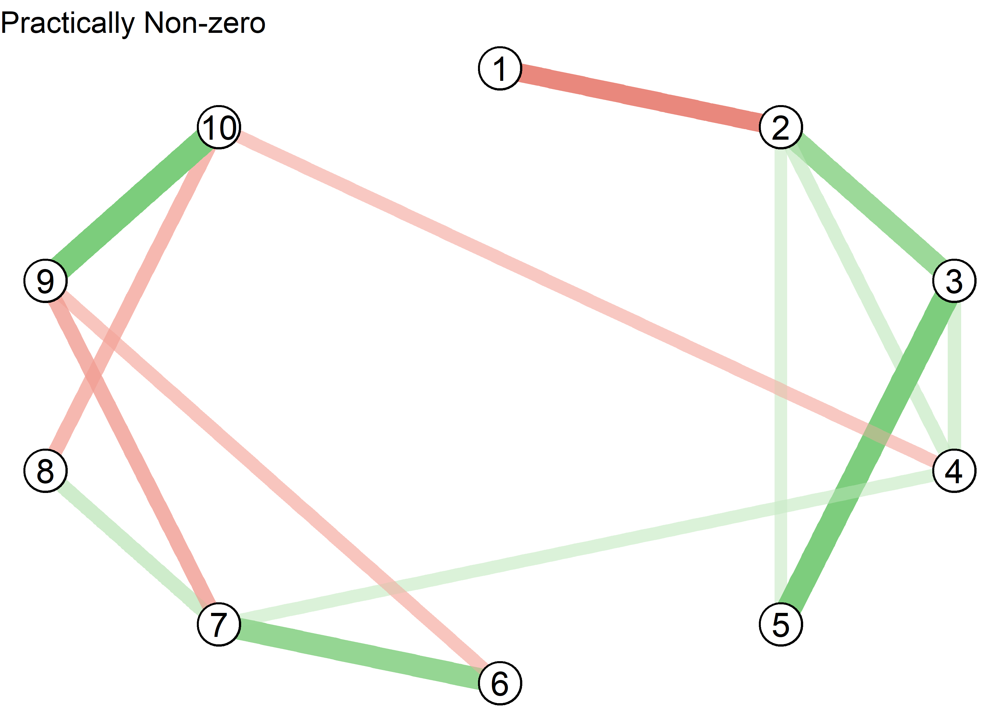
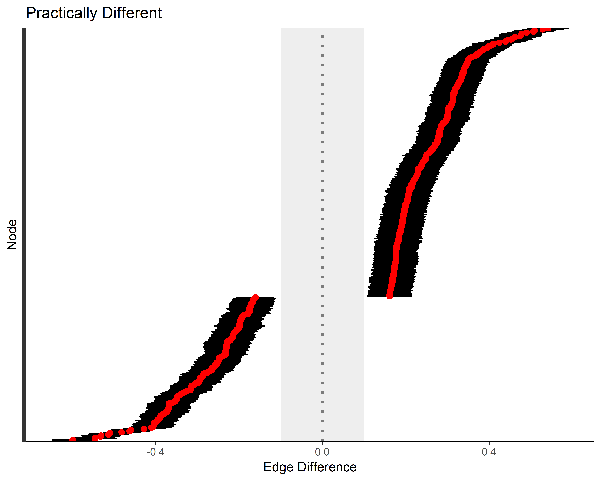
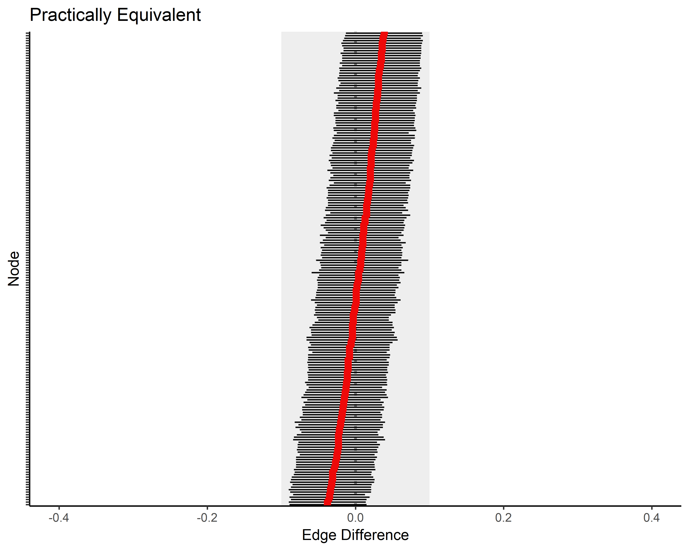
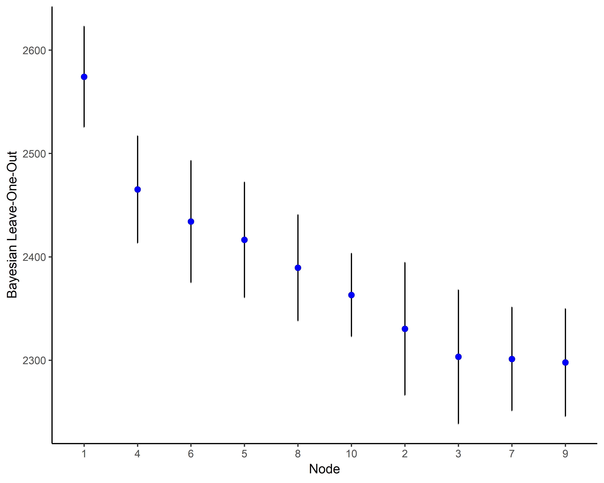
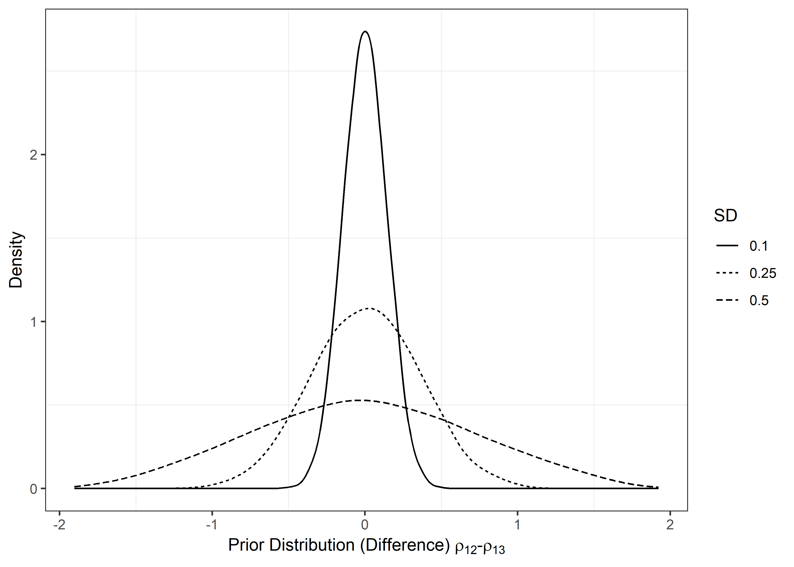

<!-- README.md is generated from README.Rmd. Please edit that file -->
BGGM
====

This package is described in Williams and Mulder (2019) and Williams (2018). The methods are separated into two Bayesian approaches for inference: hypothesis testing and estimation. The former is described in Williams and Mulder (2018a), and allows for testing for the presence of edges with the Bayes factor. One-sided hypothesis testing is also possible. These methods can also provide evidence for the null hypothesis. There are extensions for confirmatory hypothesis testing in GGMs, that can include inequality or equality constraints on the partial correlations. Further, it is possible to assess differences as well as similarities (i.e., the null hypothesis) between GGMs with the posterior predictive distribution and Bayesian model selection. The latter allows for testing hypothesized changes in graphical structures between, for example, control and treatment groups.

The estimation based methods are described in Williams (2018). The methods offer advantages compared to classical methods, in that a measure of uncertainty is provided for all parameters. For example, each node has a distribution for the variance explained (i.e., Bayesian *R*<sup>2</sup>). Measures of out-of-sample performance are also available, which also have a measure of uncertainty. The model is selected with credible interval exclusion of zero.

Williams, D. R. (2018, September 20). Bayesian Inference for Gaussian Graphical Models: Structure Learning, Explanation, and Prediction. ([pre-print](https://doi.org/10.31234/osf.io/x8dpr))

Williams, D. R., & Mulder, J. (2019, January 14). Bayesian Hypothesis Testing for Gaussian Graphical Models:Conditional Independence and Order Constraints. ([pre-print](https://doi.org/10.31234/osf.io/ypxd8))

Williams, D. R., Rast, P., Pericchi, L. R., & Mulder, J. (2019). Comparing Gaussian Graphical Models with the Posterior Predictive Distribution and Bayesian Model Selection. ([pre-print](https://psyarxiv.com/yt386/))

Installation
============

You can install BGGM from git hub with:

``` r
# install.packages("devtools")
devtools::install_github("donaldRwilliams/BGGM")
```

Estimation
==========

Structure Learning
------------------

By structure learning we are referring to selecting the graph (i.e., the edge set *E*), which consists of those edges determined to be non-zero. For demonstrative purposes, we consider a relatively small number of variables (*p* = 5). This The package **BGGM** offers a convenient analytic solution for estimating GGMs. It is implemented with:

``` r
# load pacakges
# install.packages("devtools")
# devtools::install_github("donaldRwilliams/BGGM")
library(BGGM)
library(ggplot2)
library(ggraph)
library(foreach)

# p = 5
Y <- BGGM::bfi[,1:5]

# analytic solution
fit_analytic <- estimate(Y, analytic = T)
summary(fit_analytic)
#> BGGM: Bayesian Gaussian Graphical Models 
#> --- 
#> Type: Estimation (Analytic Solution) 
#> Posterior Samples: 
#> Observations (n): 2709 
#> Variables (p): 5 
#> Edges: 10 
#> --- 
#> Call: 
#> estimate.default(x = Y, analytic = T)
#> --- 
#> Date: Sat May 11 21:14:42 2019
```

Note `summary(.)` provides information about the fitted model, including that the analytic solution was used, the number of observations (*n*) and variables (*p*), and the number of edges.

The edge set is then selected with:

``` r
E <- select(fit_analytic, ci_width = 0.95)

summary(E)
#> BGGM: Bayesian Gaussian Graphical Models 
#> --- 
#> Type: Selected Graph (Analytic Solution) 
#> Credible Interval: 95 % 
#> Connectivity: 80 % 
#> --- 
#> Call:
#> select.estimate(x = fit_analytic, ci_width = 0.95)
#> --- 
#> Selected:
#>  
#> Partial correlations 
#>  
#>       1     2     3    4    5
#> 1  0.00 -0.24 -0.11 0.00 0.00
#> 2 -0.24  0.00  0.29 0.16 0.16
#> 3 -0.11  0.29  0.00 0.18 0.36
#> 4  0.00  0.16  0.18 0.00 0.12
#> 5  0.00  0.16  0.36 0.12 0.00
#> --- 
#>  
#> Adjacency 
#>  
#>   1 2 3 4 5
#> 1 0 1 1 0 0
#> 2 1 0 1 1 1
#> 3 1 1 0 1 1
#> 4 0 1 1 0 1
#> 5 0 1 1 1 0
#> ---
```

The analytic solution works directly with the precision matrix, and thus, there is not an option to summarize the posterior distributions. This is because the non-standardized elements are in the opposite direction (±) of the partial correlations, which in our experience, can lead to confusion. To summarize the posteriors change `analytic = T` to `analytic = F`:

``` r
fit_sampling <- estimate(Y, analytic = F)

E <- select(fit_sampling, ci_width = 0.95)

summary(E, summarize = T, digits = 2)
#> BGGM: Bayesian Gaussian Graphical Models 
#> --- 
#> Type: Selected Graph (Sampling) 
#> Credible Interval: 95 % 
#> Connectivity: 80 % 
#> --- 
#> Call:
#> select.estimate(x = fit_sampling, ci_width = 0.95)
#> --- 
#> Estimates: 
#>  
#>  egde post_mean post_sd   2.5%  97.5%
#>  1--2   -0.2404   0.018 -0.276 -0.205
#>  1--3   -0.1074   0.019 -0.144 -0.071
#>  2--3    0.2860   0.018  0.251  0.321
#>  1--4   -0.0071   0.019 -0.043  0.032
#>  2--4    0.1643   0.018  0.128  0.200
#>  3--4    0.1780   0.019  0.141  0.215
#>  1--5   -0.0095   0.019 -0.048  0.029
#>  2--5    0.1564   0.019  0.120  0.194
#>  3--5    0.3588   0.017  0.324  0.391
#>  4--5    0.1218   0.019  0.085  0.158
#> ---
```

Note that `edge` corresponds to that particular entry in the partial correlation matrix--i.e., `1--2` is the relation between the first and second variables, respectively.

**BGGM** provide several options for plotting, with each implemented as a S3 generic. For example, the partial correlations can be plotted with:

``` r
# p = 10
Y <- BGGM::bfi[,1:10]

# sampling required
fit_sampling <- estimate(Y, analytic = F)

# plot
plot_1A <- plot(fit_sampling, 
                ci_width = 0.95, 
                width = 0.1,  
                size = 2) +
            coord_cartesian() +
            theme(axis.text.x = element_text(angle = 90))
  
plot_1A
```


This example nicely demonstrates how the `plot` objects can be further customized with **ggplot2**. There are two options for visualizing the selected graph. The heatmap plot is generated with:

``` r
# select the graph
E <- select(fit_sampling, ci_width = 0.95)

plot_1B <- plot(E, 
                type = "heatmap", 
                lower_tri = TRUE) +
           ggtitle("Heatmap Plot") + 
           theme(plot.title = element_text(size = 15))
plot_1B
```


Here `lower_tri = TRUE` controls which partial correlations are plotted. In this case, only the lower triangular elements are included in the plot. This can be changed with `lower_tri = FALSE`.

On the other hand, a “network” plot can be obtained with:

``` r
plot_1C <- plot(E, type = "network",
                layout ='circle',
                node_outer = 8,
                node_inner = 7,
                node_text_size = 4) +
           ggtitle("Network Plot") +
           theme(plot.title = element_text(size = 15))
plot_1C
```


A key feature of **BGGM** is extending inference beyond identifying non-zero partial correlations. The region of practical equivalence can be used for this purpose, as it allows for determining which relations are practically zero. In this case, we follow Cohen’s guidelines, wherein 0.1 is considered a small effect.This is implemented with:

``` r
# p = 10
Y <- BGGM::bfi[,1:10]

# sample from posterior
fit_sample <- estimate(Y, samples = 5000, analytic = F)

# select the graph
E <- select(fit_sample, rope = 0.1, prob = 0.95)
#> ci_width is ignored

# summary for first 10 rows
head(E, nrow = 10, summarize = T, digits = 2)
#> BGGM: Bayesian Gaussian Graphical Models 
#> --- 
#> Type: Selected Graph (Sampling) 
#> Probability: 0.95 
#> Region of Practical Equivalence:[-0.1, 0.1]
#> Connectivity: 31.1 % 
#> --- 
#> Call:
#> select.estimate(x = fit_sample, rope = 0.1, prob = 0.95)
#> --- 
#> pr_out: post prob outside of rope 
#> pr_in: post prob inside of rope 
#> --- 
#> Estimates: 
#>  
#>  egde post_mean post_sd pr_out  pr_in
#>  1--2    -0.244   0.018   1.00 0.0000
#>  1--3    -0.106   0.019   0.62 0.3822
#>  2--3     0.286   0.018   1.00 0.0000
#>  1--4    -0.015   0.020   0.00 1.0000
#>  2--4     0.161   0.019   1.00 0.0020
#>  3--4     0.160   0.019   1.00 0.0008
#>  1--5    -0.016   0.020   0.00 1.0000
#>  2--5     0.145   0.019   0.99 0.0070
#>  3--5     0.354   0.017   1.00 0.0000
#>  4--5     0.114   0.020   0.76 0.2374
#> ---
```

The argument `prob = 0.95` requires that 95 % of the posterior density be in or out of the rope to be considered practically equivalent or different from zero. With this decision rule, as seen with `head(.)`, edges `1--4` and `1--5` are practically equivalent to zero. This inference is made possible with **BGGM**.

In this case, `plot(.)` returns two objects: (1) the selected edges; (2) those for which there is support for the null values. These plots are displayed. This is implemented with:

``` r
plts <- plot(E, type = "network",
             layout ='circle',
             node_outer = 10,
             node_inner = 9,
             node_text_size = 6)

plot_1D <- plts$plot_nonzero +
             ggtitle("Practically Non-zero") +
             theme(plot.title = element_text(size = 15))

plot_1D
```



``` r
plot_1E <- plts$plot_zero +
              ggtitle("Practically Zero") +
              theme(plot.title = element_text(size = 15))

plot_1E
```


We emphasize that GGMs are often thought to capture conditionally *independent* relations--i.e., evidence for the null hypothesis of no effect, conditional on the other variables in the model. However, the dominant approach assesses conditional *dependence* (*ρ*<sub>*i**j*</sub> ≠ 0), and then sets the off-diagonal elements to zero otherwise. **BGGM** can explicitly answer the question of conditional independence.

Edge differences
----------------

Differences between partial correlations are often tested in GGMs; for example, with a classical (i.e., frequentist) approach that is implemented in **bootnet**. One contribution of **BGGM** is providing Bayesian analogs for commonly used methods, as well as extensions to those methods. In this case, we can use posterior probabilities to determine which edges are practically equivalent. This is implemented with:

``` r
# edge differences
edge_difference <- edge_compare(fit_sample, contrast = "all", ci_width = 0.95, rope = 0.1)

# summary for first 5 rows
head(edge_difference, nrow = 5)
#> BGGM: Bayesian Gaussian Graphical Models 
#> --- 
#> Type: Edge comparison(s) 
#> Credible Interval: 95 % 
#> Region of Practical Equivalence:[-0.1, 0.1]
#> --- 
#> Call:
#> edge_compare.estimate(x = fit_sample, contrast = "all", ci_width = 0.95, 
#>     rope = 0.1)
#> --- 
#> Estimates: 
#>  
#>   contrast post_mean post_sd pr_out pr_in
#>  1--2-1--3    -0.138   0.030  0.897 0.103
#>  1--2-2--3    -0.530   0.024  1.000 0.000
#>  1--2-1--4    -0.229   0.029  1.000 0.000
#>  1--2-2--4    -0.405   0.026  1.000 0.000
#>  1--2-3--4    -0.404   0.027  1.000 0.000
#> ---
```

This output includes the posterior mean and standard deviation for each difference. Further, `pr_out` is the proportion of samples included between (±) 0.1. This can be interpreted as the posterior probability of practical equivalence, which has been defined with the argument `rope = 0.1`. Further, this powerful function can be used to assess specific contrasts. This can be accomplished, for example, with 5--1 - 6--10. Note that care must be taken when specifying the contrasts, as an error will arise if they are not in the proper format.

The object `edge_difference` can the be plotted with:

``` r
plot_diff <- plot(edge_difference, prob = .99)

plot_2A <- plot_diff$plt_nonzero +
           ggtitle("Practically Different") +
           theme(axis.text.y = element_blank())
plot_2A
```



``` r
plot_2B <- plot_diff$plt_zero +
  scale_y_continuous(limits = c(-0.4, 0.4)) +
  ggtitle("Practically Equivalent") +
  theme(axis.text.y = element_blank())

plot_2B
```



This shows the central idea behind the region of practical equivalence, which is highlighted in grey. Ideally only a few contrasts would be examined in light of a guiding theory.

Prediction
----------

The following is based on the correspondence between the elements of the precision matrix and multiple regression. In the context of GGMs, using regression to select edges is referred to as “neighborhood” selection. On the other hand, the method described in Williams (2018) works directly with either the posterior distribution for precision matrix or the maximum a posteriori estimate. It follows that **BGGM** can also be used for the purpose of multiple regression–i.e.,

``` r
# p = 10
Y <- BGGM::bfi[,1:10]

# sample posterior
fit <- estimate(Y, samples = 5000)

# precision to regression
coefficients(fit, node = 1, ci_width = 0.95)
#> BGGM: Bayesian Gaussian Graphical Models 
#> --- 
#> Type: Inverse to Regression 
#> --- 
#> Call: 
#> BGGM:::beta_summary(x = fit, node = node, ci_width = ci_width, 
#>     samples = samples)
#> --- 
#> Estimates: 
#>  
#>  node post_mean post_sd   2.5%  97.5%
#>     2    -0.277   0.021 -0.318 -0.240
#>     3    -0.125   0.023 -0.171 -0.076
#>     4    -0.016   0.021 -0.056  0.023
#>     5    -0.017   0.022 -0.059  0.027
#>     6     0.056   0.021  0.015  0.097
#>     7     0.080   0.021  0.038  0.122
#>     8     0.044   0.020  0.008  0.084
#>     9     0.140   0.023  0.098  0.186
#>    10    -0.028   0.021 -0.071  0.014
#> ---
```

Here `node = 1` indicates which node is summarized. This correspondence allows forcomputing measures of prediction, including Bayesian *R*<sup>2</sup> and Bayesian leave-one-out cross-validation, each of which has a measure of uncertainty. Furthermore, when a computationally option is desirable, **BGGM** includes an analytic expression for prediction error. This is also known as the predicted residual sums of squares (PRESS).

### Bayesian *R*<sup>2</sup>

In-sample Bayesian *R*<sup>2</sup> is implemented with:

``` r
# training data
Y_train <- BGGM::bfi[1:100,1:10]

# fit to training data
fit_train <- estimate(Y_train, samples = 5000)

# compute Bayes R2
train_R2 <- predict(fit_train,
                    ci_width = 0.90,
                    samples = 1000,
                    measure = "R2")

# summary for first 2 rows
head(train_R2, nrow = 2)
#> BGGM: Bayesian Gaussian Graphical Models 
#> --- 
#> Type: In-sample predictive accuracy 
#> Measure: Variance Explained (R2) 
#> --- 
#> Call:
#> predict.estimate(fit = fit_train, ci_width = 0.9, samples = 1000, 
#>     measure = "R2")
#> --- 
#> Estimates: 
#> 
#>  node post_mean    post_sd      2.5%     97.5%
#>     1 0.1684297 0.06675745 0.0492175 0.3012937
#>     2 0.2896139 0.06828907 0.1548445 0.4121517
#> ---
```

Here `ci_width = 0.90` indicates the decision rule for setting coefficients to zero, and by default, 95 % intervals are used to in the summary output. Similarly, out-of-sample Bayesian *R*<sup>2</sup> is computed with:

``` r
Y_test <-  BGGM::bfi[101:2000,1:10]

test_R2 <- predict(fit_train, ci_width = 0.90,
                   test_data = Y_test,
                   samples = 1000, measure = "R2")
```

The work flow is completed by visualizing Bayesian *R*<sup>2</sup> for each node–i.e.,

``` r
plt_3A <- plot(x1 = train_R2, x2 =  test_R2, order = "test")
plt_3A
```


Here the nodes have been ordered by which has the best out-of-sample performance. It is also possible to predict each in seperate plot by leaving `x2` empty. The `predict` object can be used to assess differences in predictive accuracy with compare(.). **BGGM** also includes mean squared error (`measure = "mse"`).

### Leave-one-out cross-validation

Bayesian leave-one-out cross-validation is implemented with:

``` r

Y <- BGGM::bfi[1:1000,1:10]

fit_sample <- estimate(Y, samples = 5000)

bayes_loo <- loocv(fit_sample)

summary(bayes_loo)
#> BGGM: Bayesian Gaussian Graphical Models 
#> --- 
#> Type: Leave-One-Out Prediction Error (Bayesian) 
#> --- 
#> Call:
#> loocv.default(x = fit_sample)
#> --- 
#> Estimates: 
#> 
#>   node      loo   loo_se
#>     1 2574.994 49.04962
#>     2 2332.420 63.90806
#>     3 2303.256 64.29669
#>     4 2465.456 51.77724
#>     5 2416.313 55.09421
#>     6 2434.168 58.44953
#>     7 2301.237 50.31893
#>     8 2391.138 51.38851
#>     9 2295.859 51.77170
#>    10 2363.553 40.16517
#> ---
```

The results are plotted with:

``` r
plt_3B <- plot(bayes_loo, size = 8) +
          theme_classic() +
          ylab("Bayesian Leave-One-Out")
plt_3B
```



Similarly, by setting `analytic = T`, leave-one-out prediction error can be computed analytically. This is implemented with:

``` r
Y <- BGGM::bfi[1:1000,1:10]

fit_analytic <- estimate(Y, analytic = T)

press_loo <- loocv(fit_analytic)

plt_3C <- plot(press_loo, size = 8) +
          theme_classic() +
          ylab("PRESS: Leave-One-Out") +
          scale_y_continuous(expand = c(0, 0),
          limit = c(0, 1000))

plt_3C
```



This highlights the difference between the leave-one-out methods, in that the Bayesian version has a measure of uncertainty (although the order is the same). For both measures of predictive *error*, a lower value indicates a more predictable node (variable).

Hypothesis Testing
==================

Comparing GGMs
==============
