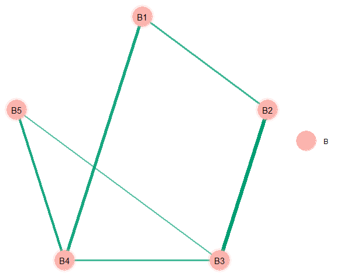
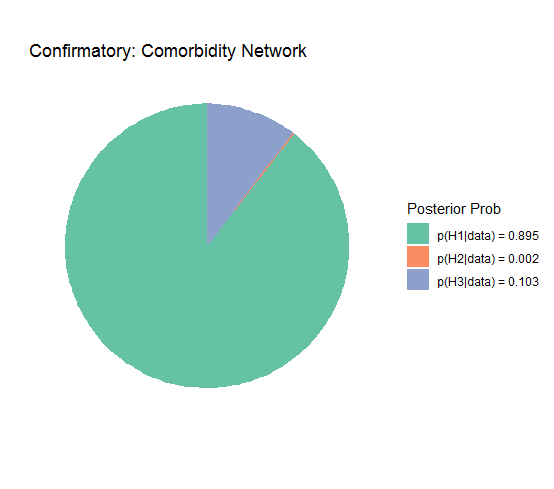
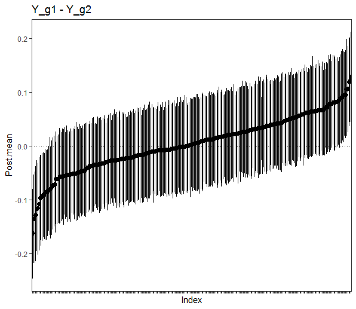
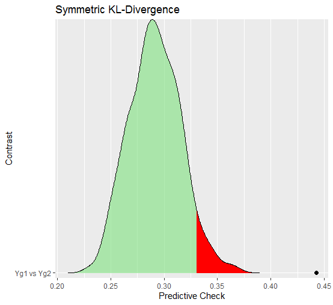
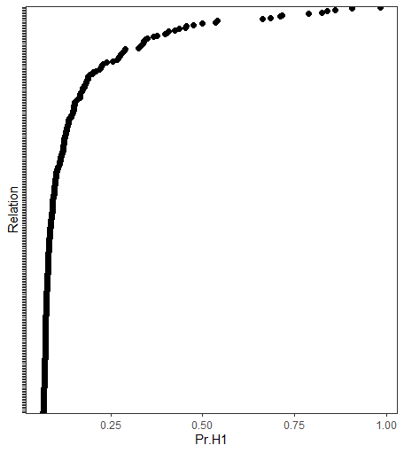
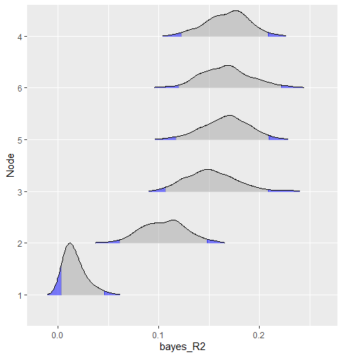
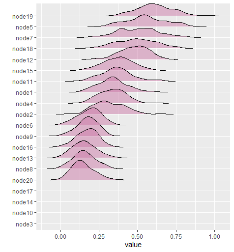
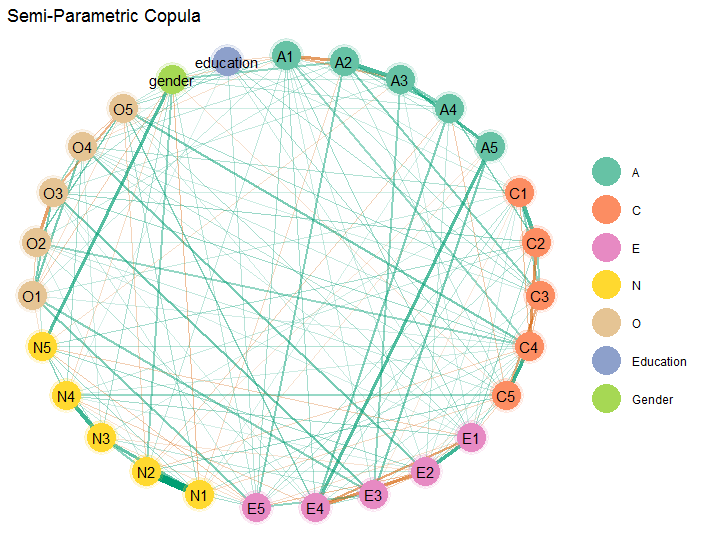

<!-- knit with rmarkdown::render("README.Rmd", output_format = "md_document") -->


# BGGM: Bayesian Gaussian Graphical Models

[](https://cran.r-project.org/package=BGGM)
[](https://cran.r-project.org/package=BGGM)
[](https://github.com/donaldRwilliams/BGGM/actions/workflows/build.yml)
[](https://joss.theoj.org/papers/10.21105/joss.02111)

The `R` package **BGGM** provides tools for making Bayesian inference in
Gaussian graphical models (GGM). The methods are organized around two
general approaches for Bayesian inference: (1) estimation and (2)
hypothesis testing. The key distinction is that the former focuses on
either the posterior or posterior predictive distribution (Gelman, Meng,
and Stern 1996; see section 5 in Rubin 1984), whereas the latter focuses
on model comparison with the Bayes factor (Jeffreys 1961; Kass and
Raftery 1995).

## What is a Gaussian Graphical Model ?

A Gaussian graphical model captures conditional (in)dependencies among a
set of variables. These are pairwise relations (partial correlations)
controlling for the effects of all other variables in the model.

### Applications

The Gaussian graphical model is used across the sciences, including (but
not limited to) economics (Millington and Niranjan 2020), climate
science (Zerenner et al. 2014), genetics (Chu et al. 2009), and
psychology (Rodriguez et al. 2020).

## Installation

To install the latest release version (`2.1.3`) from CRAN use

``` r
install.packages("BGGM")    
```

The current developmental version can be installed with

``` r
if (!requireNamespace("remotes")) { 
  install.packages("remotes")   
}   
remotes::install_github("donaldRwilliams/BGGM")
```

## Overview

The methods in **BGGM** build upon existing algorithms that are
well-known in the literature. The central contribution of **BGGM** is to
extend those approaches:

1.  Bayesian estimation with the novel matrix-F prior distribution
    (Mulder and Pericchi 2018)

    - [Estimation](#bayesian-estimation) (Williams 2018)

2.  Bayesian hypothesis testing with the matrix-F prior distribution
    (Williams and Mulder 2019)

    - [Exploratory hypothesis testing](#Exploratory)

    - [Confirmatory hypothesis testing](#Confirmatory)

3.  Comparing Gaussian graphical models (Williams 2018; Williams et al.
    2020)

    - [Partial correlation
      differences](#partial-correlation-differences)

    - [Posterior predictive check](#posterior-predictive-check)

    - [Exploratory hypothesis testing](#exploratory-groups)

    - [Confirmatory hypothesis testing](#confirmatory-groups)

4.  Extending inference beyond the conditional (in)dependence structure
    (Williams 2018)

    - [Predictability](#Predictability)

    - [Posterior uncertainty
      intervals](#partial-correlation-differences) for the partial
      correlations

    - [Custom Network Statistics](#custom-network-statistics)

The computationally intensive tasks are written in `c++` via the `R`
package **Rcpp** (Eddelbuettel et al. 2011) and the `c++` library
**Armadillo** (Sanderson and Curtin 2016). The Bayes factors are
computed with the `R` package **BFpack** (Mulder et al. 2019).
Furthermore, there are [plotting](#example-network-plot) functions for
each method, control variables can be included in the model (e.g.,
`~ gender`), and there is support for missing values (see
`bggm_missing`).

## Supported Data Types

- **Continuous**: The continuous method was described in Williams
  (2018). Note that this is based on the customary [Wishart
  distribution](https://en.wikipedia.org/wiki/Wishart_distribution).

- **Binary**: The binary method builds directly upon Talhouk, Doucet,
  and Murphy (2012) that, in turn, built upon the approaches of Lawrence
  et al. (2008) and Webb and Forster (2008) (to name a few).

- **Ordinal**: The ordinal methods require sampling thresholds. There
  are two approach included in **BGGM**. The customary approach
  described in Albert and Chib (1993) (the default) and the ‘Cowles’
  algorithm described in Cowles (1996).

- **Mixed**: The mixed data (a combination of discrete and continuous)
  method was introduced in Hoff (2007). This is a semi-parametric copula
  model (i.e., a copula GGM) based on the ranked likelihood. Note that
  this can be used for *only* ordinal data (not restricted to “mixed”
  data).

## Illustrative Examples

The following includes brief examples for *some* of the methods in
**BGGM**.

### Bayesian Estimation

#### Posterior Sampling

An ordinal GGM is estimated with

``` r
library(BGGM)
library(ggplot2)

# data
Y <- ptsd[,1:5] + 1

# ordinal
fit <- estimate(Y, type = "ordinal", 
                analytic = FALSE)
```

Notice the `+ 1`. This is required, because the first category must be
`1` when `type = "ordinal"`. The partial correlations can the be
summarized with

``` r
summary(fit)

#> BGGM: Bayesian Gaussian Graphical Models 
#> --- 
#> Type: ordinal 
#> Analytic: FALSE 
#> Formula:  
#> Posterior Samples: 250 
#> Observations (n):
#> Nodes (p): 5 
#> Relations: 10 
#> --- 
#> Call: 
#> estimate(Y = Y, type = "ordinal", analytic = FALSE, iter = 250)
#> --- 
#> Estimates:
#>  Relation Post.mean Post.sd Cred.lb Cred.ub
#>    B1--B2     0.258   0.079   0.105   0.418
#>    B1--B3     0.028   0.086  -0.127   0.189
#>    B2--B3     0.517   0.058   0.406   0.616
#>    B1--B4     0.356   0.070   0.210   0.486
#>    B2--B4    -0.076   0.078  -0.219   0.063
#>    B3--B4     0.246   0.077   0.107   0.385
#>    B1--B5     0.131   0.080  -0.020   0.279
#>    B2--B5     0.127   0.083  -0.040   0.284
#>    B3--B5     0.202   0.079   0.063   0.366
#>    B4--B5     0.349   0.070   0.209   0.474
#> --- 
```

The returned object can also be plotted, which allows for visualizing
the posterior uncertainty interval for each relation. An example is
provided below in [Posterior uncertainty
intervals](#posterior-uncertatiny). The partial correlation matrix is
accessed with

``` r
pcor_mat(fit)
```

|     |    B1 |     B2 |    B3 |     B4 |    B5 |
|:----|------:|-------:|------:|-------:|------:|
| B1  | 0.000 |  0.258 | 0.028 |  0.356 | 0.131 |
| B2  | 0.258 |  0.000 | 0.517 | -0.076 | 0.127 |
| B3  | 0.028 |  0.517 | 0.000 |  0.246 | 0.202 |
| B4  | 0.356 | -0.076 | 0.246 |  0.000 | 0.349 |
| B5  | 0.131 |  0.127 | 0.202 |  0.349 | 0.000 |

The graph is selected with

``` r
E <- select(fit)
```

and then plotted

``` r
# "communities"
comm <- substring(colnames(Y), 1, 1)

plot(select(fit), 
     groups = comm,
     edge_magnify = 5, 
     palette = "Pastel1", 
     node_size = 12)
```



This basic “workflow” can be used with all methods and data types. A
more involved network plot is provided below.

#### Analytic

There is also an analytic solution that is based on the Wishart
distribution. This simple solution provides competitive performance with
“state-of-the-art” methods, assuming that *n* (observations) \> *p*
(variables). The one caveat is that it works only for
`type = "continuous"` (the default).

``` r
# analytic
fit <- estimate(Y, analytic = TRUE)

# network plot
plot(select(fit))
```

This is quite handy when (1) only the conditional dependence structure
is of interest and (2) an immediate solution is desirable. An example of
(2) is provided in [Posterior Predictive
Check](#posterior-predictive-check).

<br>

### Bayesian Hypothesis Testing

The Bayes factor based methods allow for determining the conditional
**in**dependence structure (evidence for the null hypothesis).

#### Exploratory

``` r
# now 10 nodes
Y <- ptsd[,1:10]

# exploratory hypothesis testing
fit<- explore(Y)

# select 
E <- select(fit, alternative = "exhaustive")
```

The option `alternative = "exhaustive"` compares three hypotheses: (1) a
null relation; (2) a positive relation; and (3) a negative relation.

``` r
summary(E)

#> BGGM: Bayesian Gaussian Graphical Models 
#> --- 
#> Type: ordinal 
#> Alternative: exhaustive 
#> --- 
#> Call:
#> select.explore(object = fit, alternative = "exhaustive")
#> --- 
#> Hypotheses: 
#> H0: rho = 0
#> H1: rho > 0
#> H2: rho < 0 
#> --- 
#> 
#>  Relation Post.mean Post.sd Pr.H0 Pr.H1 Pr.H2
#>  B1--B2    0.263    0.080   0.000 0.999 0.001
#>  B1--B3    0.020    0.081   0.710 0.173 0.116
#>  B2--B3    0.523    0.073   0.000 1.000 0.000
#>  B1--B4    0.362    0.070   0.000 1.000 0.000
#>  B2--B4   -0.082    0.068   0.459 0.061 0.480
#>  B3--B4    0.252    0.073   0.000 1.000 0.000
#>  B1--B5    0.129    0.072   0.120 0.847 0.033
#>  B2--B5    0.118    0.078   0.223 0.726 0.051
#>  B3--B5    0.213    0.077   0.001 0.996 0.003
#>  B4--B5    0.348    0.072   0.000 1.000 0.000
```

The posterior hypothesis probabilities are provided in the last three
columns. When using `plot(E)`, there is a network plot for each
hypothesis.

#### Confirmatory

A central contribution of **BGGM** is confirmatory hypothesis testing of
(in)equality constraints (Hoijtink 2011). By this we are referring to
testing expectations, as opposed to feeding the data to, say,
`estimate`, and seeing what happens to emerge.

In this example, the focus is on suicidal thoughts (`PHQ9`) in a
comorbidity network. Here is an example set of hypotheses

``` r
# data (+ 1)
Y <- depression_anxiety_t1 + 1

# example hypotheses
hyp <- c("PHQ2--PHQ9 > PHQ1--PHQ9 > 0; 
          PHQ2--PHQ9 = PHQ1--PHQ9 = 0")
```

There are two hypotheses separated by (`;`). The first expresses that
the relation `PHQ2--PHQ9` (“feeling down, depressed, or hopeless” and
“suicidal thoughts”) is larger than `PHQ1--PHQ9` (“little interest or
pleasure in doing things” and “suicidal thoughts”). In other words, that
the partial correlation is larger for `PHQ2--PHQ9`. There is an
additional constraint to positive values (`> 0`) for both relations. The
second hypothesis is then a “null” model.

``` r
# (try to) confirm
fit <- confirm(Y = Y, hypothesis = hyp, 
               type = "ordinal")
```

The object `fit` is then printed

``` r
fit

#> BGGM: Bayesian Gaussian Graphical Models 
#> Type: ordinal 
#> --- 
#> Posterior Samples: 250 
#> Observations (n): 403 
#> Variables (p): 16 
#> Delta: 15 
#> --- 
#> Call:
#> confirm(Y = Y + 1, hypothesis = hyp, type = "ordinal", 
#>     iter = 250)
#> --- 
#> Hypotheses: 
#> 
#> H1: PHQ2--PHQ9>PHQ1--PHQ9>0
#> H2: PHQ2--PHQ9=PHQ1--PHQ9=0
#> H3: complement
#> --- 
#> Posterior prob: 
#> 
#> p(H1|data) = 0.895
#> p(H2|data) = 0.002
#> p(H3|data) = 0.103
#> --- 
#> Bayes factor matrix: 
#>       H1      H2    H3
#> H1 1.000 529.910 8.666
#> H2 0.002   1.000 0.016
#> H3 0.115  61.147 1.000
#> --- 
#> note: equal hypothesis prior probabilities
```

The posterior hypothesis probability is `0.895` which provides some
evidence for the order constraint. The Bayes factor matrix then divides
the posterior probabilities. This provide a measure of *relative*
support for which hypothesis the data were more likely under.

Finally, the results can be plotted

``` r
plot(fit) + 
  scale_fill_brewer(palette = "Set2", 
                    name = "Posterior Prob") +
  ggtitle("Confirmatory: Comorbidity Network")
```



This demonstrates that all the `plot()` functions in **BGGM** return
`ggplot` objects that can be further customized. Note that **BGGM** is
not focused on making publication ready plots. Typically the bare
minimum is provided that can then be honed in.

<br>

### Comparing Gaussian Graphical Models

#### Partial Correlation Differences

This method compares groups by computing the difference for each
relation in the model. In other words, there are pairwise contrasts for
each partial correlation, resulting in a posterior distribution for each
difference.

In all examples in this section, personality networks are compared for
males and females.

``` r
# data
Y <- bfi

# males
Ymales <- subset(Y, gender == 1, 
                 select = -c(gender, education))

# females
Yfemales <- subset(Y, gender == 2, 
                 select = -c(gender, education))
```

Fit the model

``` r
fit <- ggm_compare_estimate(Ymales, Yfemales)
```

Then plot the results, in this case the posterior distribution for each
difference

``` r
# plot summary
plot(summary(fit))
```



Note that it is also possible to use `select` for the object `fit` and
then plot the results. This produces a network plot including the
selected differences. Furthermore, it is also possible to plot the
partial correlations (not the differences). This is accomplished by
using `plot` with the summary computed from an `estimate` object ([see
above](#bayesian-estimation)).

#### Posterior Predictive Check

The predictive check method uses Jensen-Shannon divergence (i.e.,
symmetric Kullback-Leibler divergence
[Wikipedia](https://en.wikipedia.org/wiki/Kullback%E2%80%93Leibler_divergence))
and the sum of squared error (for the partial correlation matrices) to
compare groups (Williams et al. 2020).

The following compares the groups

``` r
fit <- ggm_compare_ppc(Ymales, Yfemales)
```

Then print the summary output with

``` r
fit

#> BGGM: Bayesian Gaussian Graphical Models 
#> --- 
#> Test: Global Predictive Check 
#> Posterior Samples: 500 
#>   Group 1: 805 
#>   Group 2: 1631 
#> Nodes:  25 
#> Relations: 300 
#> --- 
#> Call: 
#> ggm_compare_ppc(Ymales, Yfemales, iter = 500)
#> --- 
#> Symmetric KL divergence (JSD): 
#>  
#>    contrast JSD.obs p_value
#>  Yg1 vs Yg2   0.442       0
#> --- 
#>  
#> Sum of Squared Error: 
#>  
#>    contrast SSE.obs p.value
#>  Yg1 vs Yg2   0.759       0
#> --- 
#> note:
#> JSD is Jensen-Shannon divergence 
```

In this case, there seems to be decisive evidence that the networks are
different (as indicated by the posterior predictive *p*-value). The
predictive distribution can also be plotted

``` r
plot(fit, 
     critical = 0.05)$plot_jsd
```



where the red region is the “critical” area and the black point is the
observed KL divergence for the networks. This again shows that the
“distance” between the networks is much more than expected, assuming
that the groups were actually the same.

This next example is a new feature in **BGGM** (`2.0.0`), that allows
for comparing GGMs any way the user wants. All that is required is to
(1) decide on a test-statistic and (2) write a custom function.

Here is an example using Hamming distance
([Wikipedia](https://en.wikipedia.org/wiki/Hamming_distance)), which is
essentially the squared error between adjacency matrices (a test for
different structures).

First define the custom function

``` r
f <- function(Yg1, Yg2){

# remove NA
x <- na.omit(Yg1)
y <- na.omit(Yg2)

# nodes
p <- ncol(x)

# identity matrix
I_p <- diag(p)

# estimate graphs
fit1 <-  estimate(x, analytic = TRUE)
fit2 <-  estimate(y, analytic = TRUE)

# select graphs
sel1 <- select(fit1)
sel2 <- select(fit2)

# Hamming distance
sum((sel1$adj[upper.tri(I_p)] - sel2$adj[upper.tri(I_p)])^2)
}
```

Note that (1) `analytic = TRUE` is being used, which is needed in this
case because two graphs are estimated for each iteration (or draw from
the posterior predictive distribution) and (2) `f` requires two datasets
as the input and returns a single number (the chosen test-statistic).
The next step is to compute the observed Hamming distance

``` r
# observed difference
obs <- f(Ymales, Yfemales)
```

then compare the groups

``` r
fit <- ggm_compare_ppc(Ymales, Yfemales,
                             FUN = f,
                             custom_obs  = obs)

# print
fit

#> BGGM: Bayesian Gaussian Graphical Models 
#> --- 
#> Test: Global Predictive Check 
#> Posterior Samples: 250 
#>   Group 1: 805 
#>   Group 2: 1631 
#> Nodes:  25 
#> Relations: 300 
#> --- 
#> Call: 
#> ggm_compare_ppc(Ymales, Yfemales, iter = 250, FUN = f, custom_obs = obs)
#> --- 
#> Custom: 
#>  
#>    contrast custom.obs p.value
#>  Yg1 vs Yg2         75   0.576
#> --- 
```

In this case, the *p*-value does not indicate that the groups are
different for this test-statistic. This may seem contradictory to the
previous results, but it is important to note that Hamming distance asks
a much different question related to the adjacency matrices (no other
information, such as edge weights, is considered).

#### Exploratory (groups)

The Bayes factor based methods allow for determining the conditional
**in**dependence structure (evidence for the null hypothesis), in this
case for group equality.

Fit the model

``` r
fit <- ggm_compare_explore(Ymales, Yfemales)
```

Then plot the results

``` r
plot(summary(fit)) +
  theme_bw() +
  theme(panel.grid = element_blank(), 
        axis.text.y = element_blank()) 
```



Here the posterior probability for a difference is visualized for each
relation in the GGM. Note that it is also possible to use `select` for
the object `fit` and then plot the results. This produces a network plot
including the selected differences, in addition to a plot depicting the
relations for which there was evidence for the null hypothesis.

#### Confirmatory (groups)

A central contribution of **BGGM** is confirmatory hypothesis testing of
(in)equality constraints (Hoijtink 2011), in this case for comparing
groups. By this we are referring to testing expectations, as opposed to
feeding the data to, say, `estimate`, and seeing what happens to emerge.

In this example, the focus is on agreeableness in a personality network.
Here is a set of hypotheses

``` r
hyp <- c("g1_A2--A4 > g2_A2--A4 > 0 & g1_A4--A5 > g2_A4--A5 > 0;
          g1_A4--A5 = g2_A4--A5 = 0  & g1_A2--A4 = g2_A2--A4 = 0")
```

where the variables are `A2` (“inquire about others’ well being”), `A4`
(“love children”), and `A5` (“make people feel at ease”). The first
hypothesis states that the conditionally dependent effects are larger
for female than males (note the `&`), with the additional constraint to
positive values, whereas the second hypothesis is a “null” model.

The hypothesis is tested with the following

``` r
fit <- ggm_compare_confirm(Yfemales, Ymales, 
                           hypothesis = hyp)

# print
fit

#> BGGM: Bayesian Gaussian Graphical Models
#> Type: continuous
#> ---
#> Posterior Samples: 500
#>   Group 1: 1631
#>   Group 2: 805
#> Variables (p): 25
#> Relations: 300
#> Delta: 15
#> ---
#> Call:
#> ggm_compare_confirm(Yfemales, Ymales, hypothesis = hyp, iter = 500)
#> ---
#> Hypotheses:
#> 
#> H1: g1_A2--A4>g2_A2--A4>0&g1_A4--A5>g2_A4--A5>0
#> H2: g1_A4--A5=g2_A4--A5=0&g1_A2--A4=g2_A2--A4=0
#> H3: complement
#> ---
#> Posterior prob:
#> 
#> p(H1|data) = 0.989
#> p(H2|data) = 0
#> p(H3|data) = 0.011
#> ---
#> Bayes factor matrix:
#>       H1           H2     H3
#> H1 1.000 1.180798e+14 92.115
#> H2 0.000 1.000000e+00  0.000
#> H3 0.011 1.281873e+12  1.000
#> ---
#> note: equal hypothesis prior probabilities
```

The posterior hypothesis probability is 0.989 which provides strong
evidence for the hypothesis that predicted these “agreeableness”
relations would be larger in females than in males. This can also be
plotted, as in [Confirmatory (one group)](#confirmatory). See Rodriguez
et al. (2020) for a full treatment of confirmatory testing in
substantive applications.

### Beyond the Conditional (In)dependence Structure

#### Predictability

In this example, predictability is computed for each node in the network
(see here for rationale Haslbeck and Waldorp 2018). Currently **BGGM**
computes Bayesian variance explained for all data types (Gelman et al.
2019).

The following computes predictability for binary data

``` r
# binary
Y <- women_math

# fit model
fit <- estimate(Y, type = "binary")

# compute r2
r2 <- predictability(fit, iter = 500)

# plot
plot(r2, type = "ridgeline")
```



#### Posterior Uncertainty

See [Partial Correlation Differences](#partial-correlation-differences)

#### Custom Network Statistics

A new feature to **BGGM** allows for computing user defined network
statistics, given a partial correlation or weighted adjacency matrix.

Here is an example for bridge centrality (Jones, Ma, and McNally 2019).
The first step is to define the function

``` r
# need this package 
library(networktools)

# custom function
f <- function(x, ...){
 bridge(x, ...)$`Bridge Strength`
}
```

Note that `x` takes the matrix and `f` can return either a single number
or a number for each node. The next step is to fit the model and compute
the network statistic

``` r
# data
Y <- ptsd

# clusters
communities <- substring(colnames(Y), 1, 1)

# estimate the model
fit <- estimate(Y)

# bridge strength
net_stat <- roll_your_own(fit,
                          FUN = f,
                          select = TRUE,
                          communities = communities)
```

The function `f` is provided to `FUN` and `communities` is passed to
`brigde` (inside of `f`) via `...`. The results can be printed

``` r
# print
net_stat

#> BGGM: Bayesian Gaussian Graphical Models 
#> --- 
#> Network Stats: Roll Your Own
#> Posterior Samples: 100 
#> --- 
#> Estimates: 
#> 
#>  Node Post.mean Post.sd Cred.lb Cred.ub
#>     1     0.340   0.097   0.166   0.546
#>     2     0.319   0.100   0.176   0.513
#>     3     0.000   0.000   0.000   0.000
#>     4     0.337   0.086   0.189   0.489
#>     5     0.559   0.133   0.332   0.791
#>     6     0.188   0.073   0.029   0.320
#>     7     0.505   0.138   0.241   0.781
#>     8     0.153   0.070   0.022   0.286
#>     9     0.175   0.063   0.041   0.281
#>    10     0.000   0.000   0.000   0.000
#>    11     0.365   0.107   0.178   0.627
#>    12     0.479   0.093   0.280   0.637
#>    13     0.155   0.074   0.022   0.301
#>    14     0.000   0.000   0.000   0.000
#>    15     0.374   0.097   0.175   0.550
#>    16     0.174   0.065   0.034   0.295
#>    17     0.000   0.000   0.000   0.000
#>    18     0.491   0.132   0.238   0.745
#>    19     0.613   0.113   0.408   0.825
#>    20     0.144   0.066   0.038   0.289
#> --- 
```

And then plotted

``` r
plot(net_stat)
```



There are additional examples in the documentation.

### Example Network Plot

Here is an example of a more involved network plot. In this case, the
graph is estimated with a semi-parametric copula (`type = "mixed"`),
where two control variables are included in the model.

``` r
# personality (includes gender and education)
Y <- bfi

# fit copula GGM
fit <- estimate(Y, type = "mixed")

# select graph
E <- select(fit)
```

The graph is then plotted

``` r
# extract communities
comm <- substring(colnames(Y), 1, 1)

# plot
plot(E, 
     # enlarge edges
     edge_magnify = 5, 
     # cluster nodes
     groups = comm, 
     # change layout
     layout = "circle")$plt +
  # plot title
  ggtitle("Semi-Parametric Copula") +
  # add custom labels
  scale_color_brewer(breaks = c("A", "C", 
                                "E", "N", 
                                "O", "e",  
                                "g"), 
                     labels =   c("A", "C", 
                                 "E", "N", 
                                 "O",  
                                 "Education",   
                                 "Gender"), 
                     palette = "Set2")
```



Note that `layout` can be changed to any option provided in the `R`
package **sna** (Butts 2019).

## Additional Features

The primary focus of **BGGM** is Gaussian graphical modeling (the
inverse covariance matrix). The residue is a suite of useful methods not
explicitly for GGMs. For example,

### Bivariate Correlations

Bivariate correlations for `binary` (tetrachoric), `ordinal`
(polychoric), `mixed` (rank based), and `continuous` (Pearson’s) data.

Here is an example for computing tetrachoric correlations:

``` r
# binary data
Y <- women_math[1:500,]

cors <- zero_order_cors(Y, type = "binary", iter = 250)

cors$R
```

|     |      1 |      2 |      3 |      4 |      5 |      6 |
|:----|-------:|-------:|-------:|-------:|-------:|-------:|
| 1   |  1.000 | -0.198 |  0.506 |  0.122 | -0.140 |  0.098 |
| 2   | -0.198 |  1.000 | -0.482 | -0.013 | -0.146 | -0.146 |
| 3   |  0.506 | -0.482 |  1.000 |  0.310 | -0.343 |  0.351 |
| 4   |  0.122 | -0.013 |  0.310 |  1.000 | -0.363 |  0.169 |
| 5   | -0.140 | -0.146 | -0.343 | -0.363 |  1.000 | -0.194 |
| 6   |  0.098 | -0.146 |  0.351 |  0.169 | -0.194 |  1.000 |

The object `cors` also includes the sampled correlation matrices (in
this case 250) in an array.

### Multivariate Regression

Multivariate regression for binary (probit), ordinal (probit), mixed
(rank likelihood), and continuous data.

Here is an example for a multivariate probit model with an ordinal
outcome, where `E5` (“take charge”) and `N5` (“panic easily”) are
predicted by `gender` and `education`:

``` r
# personality data
Y <- bfi

# variables
Y <- subset(Y, select = c("E5", "N5", 
                          "gender", "education"))


mv_probit <- estimate(Y, formula = ~ gender + as.factor(education), 
                      type = "ordinal")
```

Note that **BGGM** does not use the customary `model.matrix`
formulation. This is for good reason, as each variable in the GGM does
not need to be written out. Here we effectively “tricked” **BGGM** to
fit a multivariate probit model (each variable included in `formula` is
removed from `Y`).

``` r
regression_summary(mv_probit)
#> BGGM: Bayesian Gaussian Graphical Models 
#> --- 
#> Type: ordinal 
#> Formula: ~ gender + as.factor(education) 
#> --- 
#> Coefficients: 
#>  
#> E5 
#>                       Post.mean Post.sd Cred.lb Cred.ub
#> (Intercept)               1.852   0.533   1.049   3.142
#> gender                    0.169   0.066   0.065   0.295
#> as.factor(education)2     0.215   0.109   0.024   0.437
#> as.factor(education)3     0.271   0.104   0.089   0.445
#> as.factor(education)4     0.206   0.103   0.019   0.404
#> as.factor(education)5     0.345   0.128   0.120   0.593
#> --- 
#> N5 
#>                       Post.mean Post.sd Cred.lb Cred.ub
#> (Intercept)               0.210   0.114  -0.012   0.434
#> gender                    0.502   0.140   0.291   0.835
#> as.factor(education)2    -0.127   0.103  -0.345   0.058
#> as.factor(education)3    -0.104   0.081  -0.258   0.034
#> as.factor(education)4    -0.218   0.104  -0.427  -0.024
#> as.factor(education)5    -0.229   0.103  -0.449  -0.038
#> --- 
#> Residual Correlation Matrix: 
#>        E5     N5
#> E5  1.000 -0.182
#> N5 -0.182  1.000
#> ---
```

This basic idea can also be used to fit regression models with a single
outcome.

## Note on Conditional (In)dependence Models for Latent Data

All of the data types (besides continuous) model latent data. That is,
unobserved data that is assumed to be Gaussian distributed. For example,
a tetrachoric correlation (binary data) is a special case of a
polychoric correlation (ordinal data). Both relations are between
“theorized normally distributed continuous *latent* variables
[Wikepedia](https://en.wikipedia.org/wiki/Polychoric_correlation). In
both instances, the corresponding partial correlation between observed
variables is conditioned on the remaining variables in the *latent*
space. This implies that interpretation is similar to continuous data,
but with respect to latent variables. We refer interested users to (see
page 2364, section 2.2, in Webb and Forster 2008).

## High Dimensional Data?

**BGGM** was built specifically for social-behavioral scientists. Of
course, the methods can be used by all researchers. However, there is
currently *not* support for high-dimensional data (i.e., more variables
than observations) that are common place in, say, the genetics
literature. These data are rare in the social-behavioral sciences. In
the future, support for high-dimensional data may be added to **BGGM**.

## Bug Reports, Feature Requests, and Contributing

Bug reports and feature requests can be made by opening an issue on
[Github](https://github.com/donaldRwilliams/BGGM/issues). To contribute
towards the development of **BGGM**, you can start a branch with a pull
request and we can discuss the proposed changes there.

## Comparison to Other Software

**BGGM** is the only `R` package to implement all of these algorithms
and methods. The `mixed` data approach is also implemented in the
package **sbgcop** (base `R`, Hoff 2007). The `R` package **BDgraph**
implements a Gaussian copula graphical model in `c++` (Mohammadi and Wit
2015), but not the binary or ordinal approaches. Furthermore, **BGGM**
is the only package for confirmatory testing and comparing graphical
models with the methods described in Williams et al. (2020).

## References

<div id="refs" class="references csl-bib-body hanging-indent"
entry-spacing="0">

<div id="ref-albert1993bayesian" class="csl-entry">

Albert, James H, and Siddhartha Chib. 1993. “Bayesian Analysis of Binary
and Polychotomous Response Data.” *Journal of the American Statistical
Association* 88 (422): 669–79.

</div>

<div id="ref-sna" class="csl-entry">

Butts, Carter T. 2019. *Sna: Tools for Social Network Analysis*.
<https://CRAN.R-project.org/package=sna>.

</div>

<div id="ref-chu2009graphical" class="csl-entry">

Chu, Jen-hwa, Scott T Weiss, Vincent J Carey, and Benjamin A Raby. 2009.
“A Graphical Model Approach for Inferring Large-Scale Networks
Integrating Gene Expression and Genetic Polymorphism.” *BMC Systems
Biology* 3 (1): 55. <https://doi.org/10.1186/1752-0509-3-55>.

</div>

<div id="ref-cowles1996accelerating" class="csl-entry">

Cowles, Mary Kathryn. 1996. “Accelerating Monte Carlo Markov Chain
Convergence for Cumulative-Link Generalized Linear Models.” *Statistics
and Computing* 6 (2): 101–11. <https://doi.org/10.1007/bf00162520>.

</div>

<div id="ref-eddelbuettel2011rcpp" class="csl-entry">

Eddelbuettel, Dirk, Romain François, J Allaire, Kevin Ushey, Qiang Kou,
N Russel, John Chambers, and D Bates. 2011. “Rcpp: Seamless r and c++
Integration.” *Journal of Statistical Software* 40 (8): 1–18.

</div>

<div id="ref-gelman_r2_2019" class="csl-entry">

Gelman, Andrew, Ben Goodrich, Jonah Gabry, and Aki Vehtari. 2019.
“<span class="nocase">R-squared for Bayesian Regression Models</span>.”
*American Statistician* 73 (3): 307–9.

</div>

<div id="ref-Gelman1996a" class="csl-entry">

Gelman, Andrew, Xiao-Li Meng, and Hal Stern. 1996. “Posterior Predictive
Assessment of Model Fitness via Realized Discrepancies.” *Statistica
Sinica* 6 (4): 733–807.

</div>

<div id="ref-haslbeck2018well" class="csl-entry">

Haslbeck, Jonas MB, and Lourens J Waldorp. 2018. “How Well Do Network
Models Predict Observations? On the Importance of Predictability in
Network Models.” *Behavior Research Methods* 50 (2): 853–61.
<https://doi.org/10.3758/s13428-017-0910-x>.

</div>

<div id="ref-hoff2007extending" class="csl-entry">

Hoff, Peter D. 2007. “Extending the Rank Likelihood for Semiparametric
Copula Estimation.” *The Annals of Applied Statistics* 1 (1): 265–83.
<https://doi.org/10.1214/07-AOAS107>.

</div>

<div id="ref-Hoijtink2011" class="csl-entry">

Hoijtink, H. 2011. *<span class="nocase">Informative hypotheses: Theory
and practice for behavioral and social scientists</span>*. Chapman;
Hall/CRC.

</div>

<div id="ref-Jeffreys1961" class="csl-entry">

Jeffreys, Harold. 1961. *<span class="nocase">The theory of
probability</span>*. Oxford: Oxford University Press.

</div>

<div id="ref-jones2019bridge" class="csl-entry">

Jones, Payton J, Ruofan Ma, and Richard J McNally. 2019. “Bridge
Centrality: A Network Approach to Understanding Comorbidity.”
*Multivariate Behavioral Research*, 1–15.

</div>

<div id="ref-Kass1995" class="csl-entry">

Kass, Robert E, and Adrian E Raftery. 1995. “Bayes Factors.” *Journal of
the American Statistical Association* 90 (430): 773–95.

</div>

<div id="ref-lawrence2008bayesian" class="csl-entry">

Lawrence, Earl, Derek Bingham, Chuanhai Liu, and Vijayan N Nair. 2008.
“Bayesian Inference for Multivariate Ordinal Data Using Parameter
Expansion.” *Technometrics* 50 (2): 182–91.

</div>

<div id="ref-millington2020partial" class="csl-entry">

Millington, Tristan, and Mahesan Niranjan. 2020. “Partial Correlation
Financial Networks.” *Applied Network Science* 5 (1): 11.
<https://doi.org/10.1007/s41109-020-0251-z>.

</div>

<div id="ref-mohammadi2015bdgraph" class="csl-entry">

Mohammadi, Reza, and Ernst C Wit. 2015. “BDgraph: An r Package for
Bayesian Structure Learning in Graphical Models.” *Journal of
Statistical Software* 89 (3). <https://doi.org/10.18637/jss.v089.i03>.

</div>

<div id="ref-mulder2019bfpack" class="csl-entry">

Mulder, Joris, Xin Gu, Anton Olsson-Collentine, Andrew Tomarken, Florian
Böing-Messing, Herbert Hoijtink, Marlyne Meijerink, et al. 2019.
“BFpack: Flexible Bayes Factor Testing of Scientific Theories in r.”
*arXiv Preprint arXiv:1911.07728*.

</div>

<div id="ref-Mulder2018" class="csl-entry">

Mulder, Joris, and Luis Pericchi. 2018. “<span class="nocase">The
Matrix-F Prior for Estimating and Testing Covariance Matrices</span>.”
*Bayesian Analysis*, no. 4: 1–22. <https://doi.org/10.1214/17-BA1092>.

</div>

<div id="ref-rodriguez2020formalizing" class="csl-entry">

Rodriguez, Josue E, Donald R Williams, Philippe Rast, and Joris Mulder.
2020. “On Formalizing Theoretical Expectations: Bayesian Testing of
Central Structures in Psychological Networks.” *PsyArXiv*.
<https://doi.org/10.31234/osf.io/zw7pf>.

</div>

<div id="ref-rubin1984bayesianly" class="csl-entry">

Rubin, Donald B. 1984. “Bayesianly Justifiable and Relevant Frequency
Calculations for the Applied Statistician.” *The Annals of Statistics*,
1151–72. <https://doi.org/10.1214/aos/1176346785>.

</div>

<div id="ref-sanderson2016armadillo" class="csl-entry">

Sanderson, Conrad, and Ryan Curtin. 2016. “Armadillo: A Template-Based
c++ Library for Linear Algebra.” *Journal of Open Source Software* 1
(2): 26. <https://doi.org/10.21105/joss.00026>.

</div>

<div id="ref-talhouk2012efficient" class="csl-entry">

Talhouk, Aline, Arnaud Doucet, and Kevin Murphy. 2012. “Efficient
Bayesian Inference for Multivariate Probit Models with Sparse Inverse
Correlation Matrices.” *Journal of Computational and Graphical
Statistics* 21 (3): 739–57.

</div>

<div id="ref-webb2008bayesian" class="csl-entry">

Webb, Emily L, and Jonathan J Forster. 2008. “Bayesian Model
Determination for Multivariate Ordinal and Binary Data.” *Computational
Statistics & Data Analysis* 52 (5): 2632–49.
<https://doi.org/10.1016/j.csda.2007.09.008>.

</div>

<div id="ref-Williams2019" class="csl-entry">

Williams, Donald R. 2018. “<span class="nocase">Bayesian Estimation for
Gaussian Graphical Models: Structure Learning, Predictability, and
Network Comparisons</span>.” *arXiv*.
<https://doi.org/10.31234/OSF.IO/X8DPR>.

</div>

<div id="ref-Williams2019_bf" class="csl-entry">

Williams, Donald R, and Joris Mulder. 2019.
“<span class="nocase">Bayesian Hypothesis Testing for Gaussian Graphical
Models: Conditional Independence and Order Constraints</span>.”
*PsyArXiv*. <https://doi.org/10.31234/osf.io/ypxd8>.

</div>

<div id="ref-williams2020comparing" class="csl-entry">

Williams, Donald R, Philippe Rast, Luis R Pericchi, and Joris Mulder.
2020. “Comparing Gaussian Graphical Models with the Posterior Predictive
Distribution and Bayesian Model Selection.” *Psychological Methods*.
<https://doi.org/10.1037/met0000254>.

</div>

<div id="ref-zerenner2014gaussian" class="csl-entry">

Zerenner, Tanja, Petra Friederichs, Klaus Lehnertz, and Andreas Hense.
2014. “A Gaussian Graphical Model Approach to Climate Networks.” *Chaos:
An Interdisciplinary Journal of Nonlinear Science* 24 (2): 023103.
<https://doi.org/10.1063/1.4870402>.

</div>

</div>
