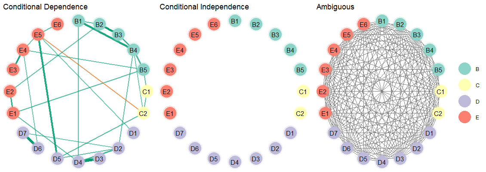

# Introduction
This vignette shows how to make network plots.

### R packages
```{r, eval = FALSE, message=FALSE}
# need the developmental version
if (!requireNamespace("remotes")) { 
  install.packages("remotes")   
}   

# install from github
remotes::install_github("donaldRwilliams/BGGM")
library(BGGM)
library(cowplot)
```
```{r, echo=FALSE, message=FALSE}
library(BGGM)
```

# Estimate
For the estimate methods, it is currently only possible detect non-zero relations and 
the others are set to zero (no connection in the graph). In a future release, it will be possible 
to define a region of equivalence to directly assess null values. Hence, it is important to note those nodes
not connected are not necessarily conditionally independent (absence of evidence is not evidence of absence).

## Fit Model
In this example, I use the `bfi` data which consists of 25 variables measureing different aspects of personality.

```{r, eval=FALSE}
# data
Y <- bfi[,1:25]

# fit model
fit <- estimate(Y)
```

## Select Graph
The next step is to selec the graph or those relations for which the credible excludes zero
```{r, eval=FALSE}
# select the edge set
E <- select(fit, 
            cred = 0.95, 
            alternative = "two.sided")
```

`alternative` can be changed to, say, `"greater"` which would then perform a one-sided hypothesis
test for postive relations. This is ideal for many applications in psychology, because often 
**all** relations are expected to be positive. See this [blog](https://donaldrwilliams.github.io/2020/03/29/dealing-with-negative-red-edges-in-psychological-networks-frequentist-edition/) for more about this topic.


## Plot Graph
Here is the basic plot. This works for any object from `select` (e.g., comparing groups).
```{r, eval=FALSE}
plot(E)
```


### Customize Plot
The above is `ggplot` that can be futher honed in. Here is an example.
```r
# extract communities
comm <- substring(colnames(Y), 1, 1)

plot(E, 
     # enlarge edges
     edge_magnify = 5, 
     # cluster nodes
     groups = comm, 
     # change layout
     layout = "circle")$plt +
  # add custom labels
  scale_color_brewer(breaks = c("A", 
                                "C", 
                                "E", 
                                "N", 
                                "O"), 
                     labels =   c("Agreeableness", "Conscientiousness", 
                                  "Extraversion", "Neuroticism", 
                                  "Opennness"),
                     palette = "Set2")

```


The `edge_magnify` is a value that is multiplied by the edges, `groups` allows for grouping the 
variables (e.g., those thought to belong to the same "community" will be the same color), and the
`scale_color_brewer` is from the package `ggplot2` (`pallete` controls the color of the `groups`). 
By default the edge colors are from a color blind palette. This can be changed in `plot` with 
the arguments `pos_col` (the color for positive edges) and `pos_neg` (the color for negative edges).

This is just scratching the surface of possibilities, as essentially any change 
can be made to the plot. There is lots of support for making nice plots readily available
online.

#### Layout
It is also possible to change the layout. This is done with the **sna** package, which is linked in the documentation for `plot.select` in **BGGM**. Here is an example using `layout = "random"`
```{r, eval=FALSE}
plot(E, 
     # enlarge edges
     edge_magnify = 5, 
     # cluster nodes
     groups = comm, 
     # change layout
     layout = "random")$plt +
  # add custom labels
  scale_color_brewer(breaks = c("A", 
                                "C", 
                                "E", 
                                "N", 
                                "O"), 
                     labels =   c("Agreeableness", "Conscientiousness", 
                                  "Extraversion", "Neuroticism", 
                                  "Opennness"),
                     palette = "Set2")
```


# Hypothesis Testing
The Bayesian hypothesis testing methods offer several advantages, for example, that 
evidence for the null hypothesis of conditional independence is formally evaluated. 
As a result, the `explore` method in **BGGM** provides plots for both the conditional 
dependence and independence structure, in addition to a plot for which the evidence was 
ambiguous.

To highlight this advantage, `ptsd` data is used that has a relatively small sample size.

```r
# fit model
fit <- explore(Y)

E <- select(fit, BF_cut = 3)
```

The plot the resits. Note that there are three plots, so the package **cowplot** is used
to combine them into one plot.

```r
plts <- plot(E, 
             edge_magnify = 5, 
             groups = comm)

plot_grid(
plts$H1_plt + 
  ggtitle("Conditional Dependence") + 
  theme(legend.position =  "none"),

plts$H0_plt + 
  ggtitle("Conditional Independence") + 
  theme(legend.position =  "none"),
plts$ambiguous_plt + 
  ggtitle("Ambiguous"), 
nrow = 1,
rel_widths = c(1, 1, 1.1)
)
```



As can be seen, there is not evidence for conditional independence for any of the relations. And
the ambiguous network makes clear there is large uncertainty as to what or what might not be the "true" network structure. This basic idea, that is, having three adjacency matrices, was proposed in @Williams2019_bf.


# Note
**BGGM** provides a publication ready plot, but it is also limited compared to **qgraph** 
[@epskamp2012qgraph]. The one advantage of **BGGM**  is that all plots are `ggplots` 
which then allows for combining them rather easily. An example is included in another 
vignette that shows how to combine several plots made with various methods in **BGGM**


# References
