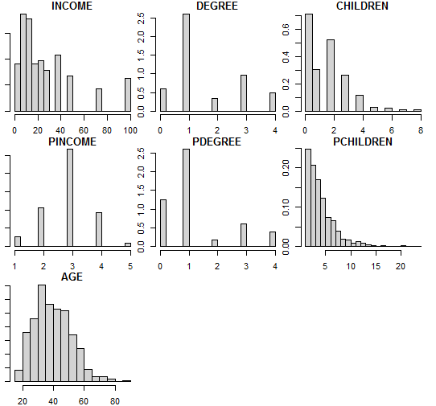
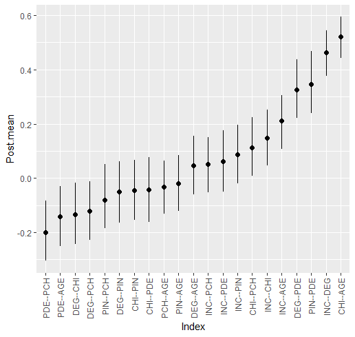

```{r, echo = FALSE, message=F}
knitr::opts_chunk$set(
  collapse = TRUE,
  comment = "#>",
  fig.path = "man/figures/README-",
  dev = "png",
  dpi = 500,
  fig.align = "center",
  knitr::opts_chunk$set(comment = NA)
  )
library(ggplot2)
library(BGGM)
```

# Bayesian Gaussian Graphical Models 
<!--  -->


<!-- badges: start -->
[](https://cran.r-project.org/package=BGGM)
[](https://cran.r-project.org/package=BGGM)
[](https://travis-ci.org/donaldRwilliams/BGGM)
<!-- badges: end -->


The `R` package **BGGM** provides tools for making Bayesian inference in 
Gaussian graphical models [GGM, @williams2020bggm]. The methods are organized around 
two general approaches for Bayesian inference: (1) estimation and (2) hypothesis 
testing. The key distinction is that the former focuses on either the posterior or posterior 
predictive distribution [@Gelman1996a; see section 5 in @rubin1984bayesianly], whereas the 
latter focuses on model comparison with the Bayes factor [@Jeffreys1961; @Kass1995].

## Installation

To install the latest release version (1.0.0) from CRAN use
```{r gh-installation, eval = FALSE}	
install.packages("BGGM")	
```

The current developmental version can be installed with	

```{r, eval = FALSE}	
if (!requireNamespace("remotes")) {	
  install.packages("remotes")	
}	
remotes::install_github("donaldRwilliams/BGGM")
```

Note that the developmental version is recommended, due to the algorithms being written in `c++` and 
support for all data types. The developmental version is essentially
**BGGM** version 2.0.0.


## Overview
The methods in **BGGM** build upon existing algorithms that are well-known in the literature.
The central contribution of **BGGM** is to extend those approaches:

1.  Bayesian estimation with the novel matrix-F prior distribution [@Mulder2018]
  
    + Estimation [@Williams2019]

2. Bayesian hypothesis testing with the matrix-F prior distribution [@Williams2019_bf]

    + [Exploratory hypothesis testing](https://github.com/donaldRwilliams/BGGM#Exploratory)
  
    + [Confirmatory hypothesis testing](https://github.com/donaldRwilliams/BGGM#confirmatory)
    
3. Comparing Gaussian graphical models [@Williams2019; @williams2020comparing]
    
    + [Partial correlation differences](https://github.com/donaldRwilliams/BGGM#partial-correlation-differences)
    
    + [Posterior predictive check](https://github.com/donaldRwilliams/BGGM#posterior-predictive-check)
    
    + [Exploratory hypothesis testing](https://github.com/donaldRwilliams/BGGM#exploratory-groups)
    
    + [Confirmatory hypothesis testing](https://github.com/donaldRwilliams/BGGM#confirmatory-groups)

4. Extending inference beyond the conditional (in)dependence structure [@Williams2019]

    +  [Predictability](https://github.com/donaldRwilliams/BGGM#predictability)
    
    +  [Posterior uncertainty intervals](https://github.com/donaldRwilliams/BGGM#posterior-uncertainty) for the 
       partial correlations
       
    +  [Custom Network Statistics](https://github.com/donaldRwilliams/BGGM#custom-network-statistics)
    
    
The computationally intensive tasks are written in `c++` via the `R` package **Rcpp** [@eddelbuettel2011rcpp] and the `c++` library **Armadillo** [@sanderson2016armadillo]. The Bayes factors are computed with the `R` package **BFpack** [@mulder2019bfpack]. Furthermore, there are plotting functions
for each method, control variables can be included in the model (e.g., `~ gender`), 
and there is support for missing values (see `bggm_missing`).

## Supported Data Types

* **Continuous**: The continuous method was described in  @Williams2019. Note that 
                  this is based on the customary [Wishart distribution](https://en.wikipedia.org/wiki/Wishart_distribution).

* **Binary**: The binary method builds directly upon @talhouk2012efficient
  that, in turn, built upon the approaches of @lawrence2008bayesian and
  @webb2008bayesian (to name a few).
  
* **Ordinal**: The ordinal methods require sampling thresholds. There are two approach 
   included in **BGGM**. The customary approach described in @albert1993bayesian 
   (the default) and the 'Cowles' algorithm described in @cowles1996accelerating.
   
* **Mixed**: The mixed data (a combination of discrete and continuous) method was introduced
 in @hoff2007extending. This is a semi-parametric copula model
 (i.e., a copula GGM) based on the ranked likelihood. Note that this can be used for 
 *only* ordinal data (not restricted to "mixed" data).


## Illustrative Examples
There are several vignettes in the [Articles](https://donaldrwilliams.github.io/BGGM/articles/) section.

## Basic Usage
It is common to have some combination of continuous and discrete (e.g., ordinal, binary, etc.) variables. **BGGM** (as of version `2.0.0`) can readily be used for these kinds of data. In this example, a model is fitted for the `gss` data in **BGGM**. 

### Visualize
The data are first visualized with the **psych** package, which readily shows the data are "mixed". 
```r
# dev version
library(BGGM)
library(psych)

# data
Y <- gss

# histogram for each node
psych::multi.hist(Y, density = FALSE)
```



### Fit Model
A Gaussian copula graphical model is estimated as follows
```r
fit <- estimate(Y, type = "mixed")
```
`type` can be `continuous`, `binary`, `ordinal`, or `mixed`. Note that `type` is a misnomer, as the data can consist of *only* ordinal variables (for example).


### Summarize Relations
The estimated relations are summarized with
```r
summary(fit)

#> BGGM: Bayesian Gaussian Graphical Models 
#> --- 
#> Type: mixed 
#> Analytic: FALSE 
#> Formula:  
#> Posterior Samples: 5000 
#> Observations (n): 464  
#> Nodes (p): 7 
#> Relations: 21 
#> --- 
#> Call: 
#> estimate(Y = Y, type = "mixed")
#> --- 
#> Estimates:
#>  Relation Post.mean Post.sd Cred.lb Cred.ub
#>  INC--DEG     0.463   0.042   0.377   0.544
#>  INC--CHI     0.148   0.053   0.047   0.251
#>  DEG--CHI    -0.133   0.058  -0.244  -0.018
#>  INC--PIN     0.087   0.054  -0.019   0.196
#>  DEG--PIN    -0.050   0.058  -0.165   0.062
#>  CHI--PIN    -0.045   0.057  -0.155   0.067
#>  INC--PDE     0.061   0.057  -0.050   0.175
#>  DEG--PDE     0.326   0.056   0.221   0.438
#>  CHI--PDE    -0.043   0.062  -0.162   0.078
#>  PIN--PDE     0.345   0.059   0.239   0.468
#>  INC--PCH     0.052   0.052  -0.052   0.150
#>  DEG--PCH    -0.121   0.056  -0.228  -0.012
#>  CHI--PCH     0.113   0.056   0.007   0.224
#>  PIN--PCH    -0.080   0.059  -0.185   0.052
#>  PDE--PCH    -0.200   0.058  -0.305  -0.082
#>  INC--AGE     0.211   0.050   0.107   0.306
#>  DEG--AGE     0.046   0.055  -0.061   0.156
#>  CHI--AGE     0.522   0.039   0.442   0.594
#>  PIN--AGE    -0.020   0.054  -0.122   0.085
#>  PDE--AGE    -0.141   0.057  -0.251  -0.030
#>  PCH--AGE    -0.033   0.051  -0.132   0.063
#> --- 
```

The summary can also be plotted
```r
plot(summary(fit))
```


### Graph Selection
The graph is selected and plotted with
```r
E <- select(fit)

plot(E, node_size = 12,
     edge_magnify = 5)
```


The Bayes factor testing approach is readily implemented by changing `estimate` to `explore`. 

## References
