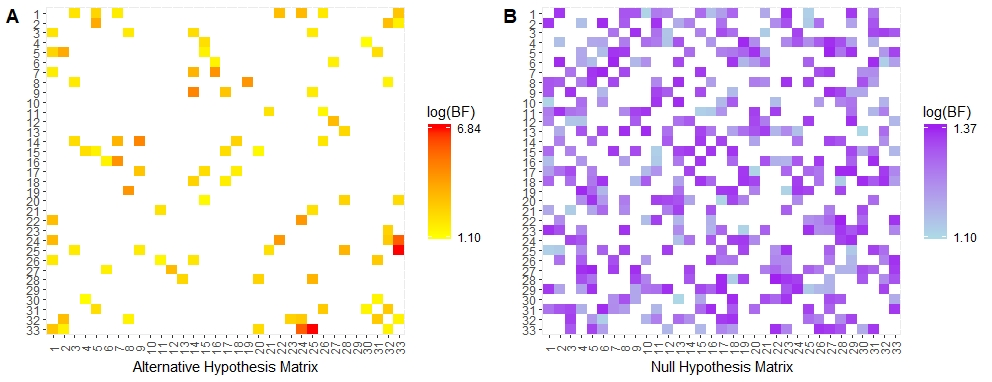
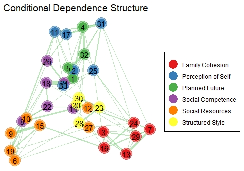
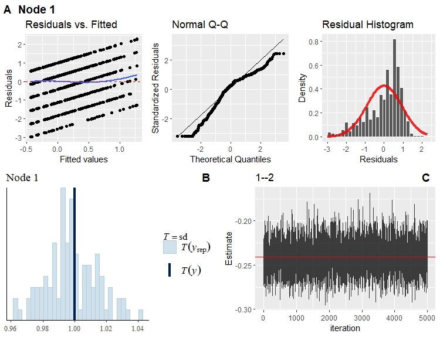

---
# Example from https://joss.readthedocs.io/en/latest/submitting.html
title: 'BGGM: Bayesian Gaussian Graphical Models in R'
tags:
- Gaussian graphical models
- Bayesian
- Bayes factor
- partial correlation
- R
authors:
  - name: Donald R. Williams
    affiliation: 1 # (Multiple affiliations must be quoted)
  - name: Joris Mulder
    affiliation: 2
affiliations:
 - name: Department of Psychology, University of California, Davis
   index: 1
 - name: Department of Methodology and Statistics, Tilburg University
   index: 2
citation_author: Williams and Mulder
date: 07 January 2020
year: 2020
bibliography: paper.bib
output: rticles::joss_article
csl: apa.csl
journal: JOSS
submitted: 07 January 2020
published: (pre-print)
---

# Summary
Gaussian graphical models (GGM) allow for learning conditional (in)dependence structures that are encoded by partial correlations. Whereas there are several `R` packages for classical methods [see @Kuismin2017, Table 1], there are only two that implement a Bayesian approach [@Leday2018; @Mohammadi2015a]. These are exclusively focused on identifying the graphical structure. The package **BGGM** not only contains novel Bayesian methods for this purpose, but it also includes Bayesian methodology for extending inference beyond identifying non-zero relations. 

**BGGM** is built around two approaches for *Bayesian* inference--estimation and hypothesis testing. This distinction is arbitrary [see @Rouder2018], but is used to organize this work.  The former focuses on the posterior distribution and includes extensions to assess predictability [@Haslbeck2018], as well as methodology to compare partial correlations. The latter includes methods for Bayesian hypothesis testing, in both exploratory and confirmatory contexts, with the novel matrix-$F$ prior distribution [@Mulder2018]. This allows for testing the null hypothesis of conditional independence, as well as inequality and equality constrained hypotheses. Further, there are several approaches for comparing GGMs across any number of groups.  The package also includes a suite of options for model checking. Together, **BGGM** is a comprehensive toolbox for Gaussian graphical modeling in `R`. 

## Estimation
There are two possibilities for *estimating* GGMs. The first is an analytic solution and the second samples from the posterior distribution [described in @Williams2018bayes]. Sampling is recommended because the samples are required for various functions in **BGGM** (e.g., posterior predictive checks and prediction). 

### Structure Learning
Structure learning refers to determining which partial correlations are non-zero. This is implemented with:

```r
# data (p = 5 for demonstrative purposes)
Y <- BGGM::bfi[,1:5]

# fit model
fit <- estimate(Y = Y, 
                analytic = FALSE, 
                iter = 1000)

# select graph
E <- select(fit_analytic, ci_width = 0.95)

# summary
summary(E)

# output

BGGM: Bayesian Gaussian Graphical Models 
--- 
Type: Selected Graph (Analytic Solution) 
Credible Interval: 95 % 
Connectivity: 80 % 
--- 
Call:
select.estimate(x = fit_analytic, ci_width = 0.95)
--- 
Selected:
 
Partial correlations 
 
      1     2     3    4    5
1  0.00 -0.24 -0.11 0.00 0.00
2 -0.24  0.00  0.29 0.16 0.16
3 -0.11  0.29  0.00 0.18 0.36
4  0.00  0.16  0.18 0.00 0.12
5  0.00  0.16  0.36 0.12 0.00
--- 
 
Adjacency 
 
  1 2 3 4 5
1 0 1 1 0 0
2 1 0 1 1 1
3 1 1 0 1 1
4 0 1 1 0 1
5 0 1 1 1 0
--- 
```
It is customary to plot the estimated structure. The implement ion for plotting `E` is described below, as the same call is also used for the hypothesis testing methodology.

The partial correlations are plotted with:
```r
# summarize the posterior distributions
fit_summary <- summary(fit, cred = 0.95)

# plot summary
fig_1a <- plot(fit_summary) 
```


The object `fit_summary` includes the partial correlation that have been summarized with the posterior mean, standard deviation, and a given credible interval. The object `fig_1a` is a `ggplot` [@ggplot], which allows for further customization. This is possible with all `plot()` functions in **BGGM**. An example is provided below.


### Predictability
A central aspect of **BGGM** is to extend inference beyond the individual partial correlations. Assessing *predictability* provides a measure of "self-determination" [@Haslbeck2018], for example, how much variance is explained by the variables included in the model. To this end, **BGGM** provides several options to assess predictability . In this example, we compute Bayesian $R^2$ [@gelman_r2_2019]:

```r
# bayes r2
r2 <- bayes_R2(fit)

fig_1b <- plot(r2, 
               type = "ridgeline")

# output
BGGM: Bayesian Gaussian Graphical Models 
--- 
Metric: Bayes R2
Type: post.pred 
Credible Interval: 0.95 
--- 
Estimates:

 Node Post.mean Post.sd Cred.lb Cred.ub
    1      0.13    0.01    0.10    0.15
    2      0.33    0.02    0.30    0.36
    3      0.38    0.02    0.35    0.41
    4      0.18    0.01    0.15    0.20
    5      0.29    0.02    0.26    0.32
```

`fig_1b` is made with the help of the **ggridges** package [@ggridges].

### Comparing GGMs
There is additional methodology that allows for comparing GGMs [described in @williams_ggmcompare]. For the estimation based methods, there are three possibilities, including `ggm_compare_estimate()`, `assess_predictability()` and `ggm_compare_ppc()` . We encourage user to explore all of those functions. The following is based on the posterior predictive distribution. In this example, we use data from a  resilience
survey to compare GGMs between males and females [@brigantiresilience].

```r
# data
Ym <- subset(rsa, gender == "M", 
             select = - gender)
Yf <- subset(rsa, gender == "F", 
             select = - gender )

# predictive check
ppc <- ggm_compare_ppc(Ym, Yf)

fig_1c <- plot(ppc)

# summary
summary(ppc)

# output
BGGM: Bayesian Gaussian Graphical Models 
--- 
Type: GGM Comparison (Global Predictive Check) 
Posterior Samples: 5000 
  Group 1: 278 
  Group 2: 397 
Variables (p): 33 
Edges: 528 
--- 
Call: 
ggm_compare_ppc(Ym, Yf)
--- 
Estimates: 
 
     contrast      KLD p_value
 Y_g1 vs Y_g2 2.512792       0
--- 
note: 
p_value = p(T(Y_rep) > T(Y)|Y)
KLD = (symmetric) Kullback-Leibler divergence
```
Note that this method can be used to compare any number of groups.

## Hypothesis Testing
The following methods were described in @williams_bayesian_2019.  Note that each function has `summary()`, `print()`, and `plot()` functions. The implementation is similar to the estimation based methods, and thus not included here. 

### Structure Learning
The Bayes factor methods allow for gaining evidence for null effects, as well as for one-sided hypothesis testing.

```r
# data
Y <- bfi[,1:5]

# fit model
fit <- explore(Y)

# select graph
E <- select(fit, 
            BF_cut = 3, 
            alternative = "greater")
```
The object `E` includes the selected graphs for which there was evidence for a positive effect and a null effect. This can be plotted with `plot(E)`. An example is provided below.

### Confirmatory Hypothesis Testing
GGMs are typically data driven and thus inherently exploratory. Another key contribution of **BGGM** is extending hypothesis testing beyond exploratory and to confirmatory in GGMs [ @williams_bayesian_2019]. The former is essentially feeding
the data to the functions in **BGGM** and seeing what comes back. In other words, there are no specific, hypothesized models under consideration. On the other hand, confirmatory hypothesis testing allows for comparing theoretical models or (actual) predictions. A researcher may expect, for example, that a set of partial correlations is larger than another set. This is tested with:

```r
# define hypothesis
hypothesis <- c("(A1--A2, A1--A3) >  
                 (A1--A4, A1--A5)")

# test inequality contraint
test_order <-  confirm(Y = Y, 
                       hypothesis  = hypothesis,
                       prior_sd = 0.5, iter = 5000,
                       cores = 2)
# output
BGGM: Bayesian Gaussian Graphical Models 
Type: Confirmatory Hypothesis Testing 
--- 
Call:
confirm(Y = Y, hypothesis = hypothesis, prior_sd = 0.5, iter = 5000, 
    cores = 2)
--- 
Hypotheses: 
                                   
 H1 (A1--A2,A1--A3)>(A1--A4,A1--A5)
 Hc                        'not H1'
--- 
Posterior prob: 
            
 p(H1|Y) = 0
 p(Hc|Y) = 1
--- 
Bayes factor matrix: 
   H1  Hc
H1  1 Inf
Hc  0   1
--- 
note: equal hypothesis prior probabilities
```
Note that `A1--A2` denotes the partial correlation between variables A1 and A2. Any number of hypothesis can be tested. They just need to be separated by a a semi-colon, e.g., `hypothesis = c(A1--A2 > 0; A1--A2 = 0)`, which also demonstrates that it is possible to simultaneously test both inequality (`>` or `<`) and equality (`=`) restrictions.

### Comparing GGMs
The Bayes factor approach can also be used to compare GGMs [see @williams_ggmcompare]. 

```r
# compare
bf_comp <- ggm_compare_bf(Ym, Yf, 
                          prior_sd = 0.20)

# select
sel <- select(bf_comp, 
              BF_cut = 3)

# figure 2
fig_2 <- plot(sel)
```


The results are provided in Figure 2. Note that confirmatory hypothesis testing is also possible. This uses the same arguments as those provided above.

## Plotting GGMs
Plotting both the estimate and hypothesis testing graphs uses the same arguments. The following is an example of plotting a graph estimated with `explore`.

```r
# resilience scale
Y <- subset(rsa, select = - gender)

# fit model 
fit <- explore(Y)

# select graph
E <- select(fit, 
            BF_cut = 3, 
            alternative = "greater")

# plot graph
fig_3 <- plot(E, layout = "mds", 
              node_labels_color = "black",
              node_groups = BGGM:::rsa_labels, 
              txt_size = 4, node_outer_size = 8, 
              node_inner_size = 6, 
              edge_multiplier = 5, 
              alpha = 0.3)$plt + 
  # remove legend name and set palette
  scale_color_brewer(name = NULL, 
                     palette = "Set1")  +
  # add title
  ggtitle("Conditional Dependence Structure") +
  # make title larger and add box around legend
  theme(plot.title = element_text(size = 14), 
        legend.background = element_rect(color = "black"))
```




## Model Checking
The methods in **BGGM** use custom samplers to estimate the partial correlations. There are several functions to monitor convergence. Additionally, there are a variety of methods to check the adequacy of the fitted model.

### Regression Diagnostics
GGMs have a direct correspondence to multiple regression [@Stephens2018; @Kwan2014]. Hence regression diagnostics can be used to evaluate the fitted model.

```r
# data
Y <- bfi[,1:5]

# fit model
fit <- estimate(Y)

# plot
fig_4a <- diagnostics(fit, iter = 100)
```
The object `fig_4a` contains one plot for each variable in model (in this case five). One of those plots is included in Figure 4 (panel A).

### Posterior Predictive Checks
In **BGGM**, posterior predictive checks are carried out with the `R` package **bayesplot** [@bayesplot]. Some internal code was borrowed from **brms** to achieve consistent between packages .

```r
fig_4b <- pp_check(fit, 
                   type = "stat", 
                   stat = "sd")
```
The object `fig_4b` also contains one plot for each variable in model. One of those plots is included in Figure 4 (panel B). Note that this implementation is based on the internals of the `pp_check()` function from **brms** [@brms], but adapted for GGMs. This ensures that there is consistency between packages using **bayesplot**.

### MCMC Convergence
**BGGM** uses Gibbs samplers to estimate GGMs. The models are not terribly difficult to estimate, so convergence should typically not be an issue. To verify convergence, however, **BGGM** provide both trace and acf plots. An example of the former is implemented with:

```r
fig_4c <- convergence(fit, 
                      type = "trace", 
                      param = "1--2")
```
This plot is in Figure 4 (panel C). Note that it is possible to check the convergence of several parameters (e.g., `param = c(1--2, 1--3)`).


## Discussion
There are several additional functions in **BGGM** not discussed in this work. For example, there are a variety of options for predictability (e.g., mean squared error), plotting capabilities for `confirm()`, among others. We encourage users to explore the package documentation. We are committed to further developing **BGGM**. In the next version, all of the methods will accommodate ordinal, binary, and mixed data.  Currently, there is one **shiny**  application freely available online that implements the `confirm()` method  [(link)](https://donald-williams.shinyapps.io/confirm/) [@shinyapp]. In the near future, all of the methods in **BGGM** will be implemented in a **shinydashboard** [@shinydb].

## Acknowledgements
DRW was supported by a National Science Foundation Graduate Research Fellowship under Grant No. 1650042 and JM was supported by a ERC Starting Grant (758791).

## References
