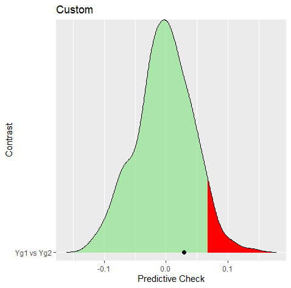
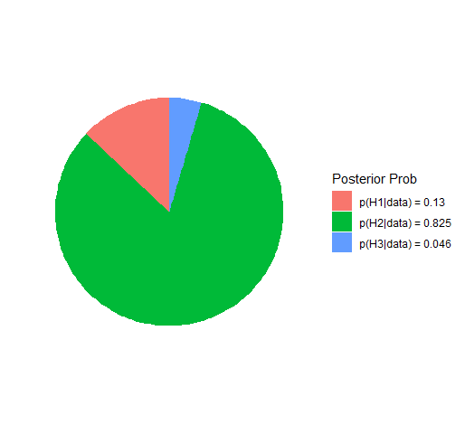

# Introduction
On a Facebook methods group, there was a question about testing hypotheses in networks. In 
the comments, it was suggested that **BGGM** could be used to test the hypothesis. And it turns
out that **BGGM** really shines for testing exceptions or predictions. In this vignette, I demonstrate 
three ways to go about testing the same hypothesis, which was essentially testing for a difference
in the **sum** of partial correlations between groups.

### R package
```{r, eval = FALSE, message=FALSE}
# need the developmental version
if (!requireNamespace("remotes")) { 
  install.packages("remotes")   
}   

# install from github
remotes::install_github("donaldRwilliams/BGGM")
library(BGGM)
```

### Data
For demonstrative purposed, I use the `bfi` data and test the hypotheses in males and females

```
# data
Y <- bfi

# males
Y_males <- subset(Y, gender == 1, select = -c(education, gender))[,1:5]

# females
Y_females <- subset(Y, gender == 2, select = -c(education, gender))[,1:5]
```

# Approach 1: Posterior Difference
The first approach is rather straightforward, with the caveat that the method needs to be implemented by the user
Note that I could certainly implement this in **BGGM**, assuming there is enough interest. Please make a feature request here.

## Hypothesis
The hypothesis was that a sum of relations was larger in one group, for example,

$$
\begin{align}
\mathcal{H}_0: (\rho^{male}_{A1--A2}\; + \; \rho^{female}_{A1--A3}) = (\rho^{female}_{A1--A2}\; + \; \rho^{female}_{A1--A3}) \\
\mathcal{H}_1: (\rho^{male}_{A1--A2}\; + \; \rho^{female}_{A1--A3}) > (\rho^{female}_{A1--A2}\; + \; \rho^{female}_{A1--A3})
\end{align}
$$
Note that the hypothesis is related to the sum of relations, which is readily tested in **BGGM**. 

## Fit Models
The first step is to estimate the model for each group

```r
# fit female
fit_female <- estimate(Y_females, seed = 2)

# fit males
fit_male <- estimate(Y_males, seed = 1)
```
For an example, I used the default which is to assume the data is Gaussian. This can be changed with `type = ` either `binary`, `ordinal`, or `mixed`.

## Extract the Samples
The next step is to extract the posterior samples for each relation

```r
post_male <- posterior_samples(fit_male)[,c("A1--A2", "A1--A3")]

post_female <- posterior_samples(fit_female)[,c("A1--A2", "A1--A3")]
```

## Sum and Compute Difference
The next step is to sum the relations and compute the difference

```r
# sum males
sum_male <- rowSums(post_male) 

# sum females
sum_female <- rowSums(post_female)

# difference
diff <- sum_male - sum_female
```
which can then be plotted
```r
par(mfrow=c(1,3))
hist(sum_male)
hist(sum_female)
hist(diff)
```


## Posterior Probability
Next compute the posterior probability the sum is larger in males than females

```r
# posterior prob
mean(sum_male > sum_female)

#> 0.737
```
and then the credible interval for the difference

```
quantile(diff, probs = c(0.025, 0.975))

#>        2.5%       97.5% 
#> -0.06498586  0.12481253 
```

# Approach 2: Predict Check
The next approach is based on a posterior predictive check. The hypothesis is essentially the same as above, but for the predictive distribution, that is,

$$
\begin{align}
\mathcal{H}_0: (\rho^{male^{yrep}}_{A1--A2}\; + \; \rho^{female^{yrep}}_{A1--A3}) = (\rho^{female^{yrep}}_{A1--A2}\; + \; \rho^{female^{yrep}}_{A1--A3}) \\
\mathcal{H}_1: (\rho^{male^{yrep}}_{A1--A2}\; + \; \rho^{female^{yrep}}_{A1--A3}) > (\rho^{female^{yrep}}_{A1--A2}\; + \; \rho^{female^{yrep}}_{A1--A3})
\end{align}
$$
where the only difference is $yrep$. See more details [here](https://donaldrwilliams.github.io/BGGM/articles/ppc_custom.html).

## Define Function
The first step is to define a function to compute the difference in sums
```r
# colnames
cn <- colnames(Y_males)

# function
f <- function(Yg1, Yg2){
  
  # data
  Yg1 <- na.omit(Yg1)  
  Yg2 <- na.omit(Yg2)

  # estimate partials
  fit1 <- pcor_mat(estimate(Yg1, analytic = TRUE))
  fit2 <- pcor_mat(estimate(Yg2, analytic = TRUE))
  
  # names (not needed)
  colnames(fit1) <- cn
  rownames(fit1) <- cn
  colnames(fit2) <- cn
  rownames(fit2) <- cn
  
  # take sum
  sum1 <- fit1["A1", "A2"] + fit1["A1", "A3"]
  sum2 <- fit2["A1", "A2"] + fit2["A1", "A3"]
  
  # difference
  sum1 - sum2

}
```

Note that the function takes two data matrices and then returns a single value.

## Predictive Check
The next step is to compute the observed difference and then perform the check.

```r
# observed
obs <- f(Y_males, Y_females)

# check
ppc <- ggm_compare_ppc(Y_males, Y_females, 
                       iter = 250, 
                       FUN = f, 
                       custom_obs = obs)

# print
ppc

#> BGGM: Bayesian Gaussian Graphical Models 
#> --- 
#> Test: Global Predictive Check 
#> Posterior Samples: 250 
#>   Group 1: 896 
#>   Group 2: 1813 
#> Nodes:  5 
#> Relations: 10 
#> --- 
#> Call: 
#> ggm_compare_ppc(Y_males, Y_females, iter = 250, FUN = f, custom_obs = obs)
#> --- 
#> Custom: 
#>  
#>    contrast custom.obs p.value
#>  Yg1 vs Yg2      0.029   0.264
#> --- 
```

Note this requires the user to determine $\alpha$. 

## Plot 
The check can also be plotted

```r
plot(ppc)
```


where the red is the critical region.

# Approach 3: Bayesian Hypothesis testing
The above approaches cannot provide evidence that the sum is equal. In other words, just because there was 
not a difference, this does not provide evidence for equality. The Bayes factor methods allow for formally 
assessing the equality model, that is,

$$
\begin{align}
\mathcal{H}_1&: (\rho^{male}_{A1--A2}\; + \; \rho^{female}_{A1--A3}) > (\rho^{female}_{A1--A2}\; + \; \rho^{female}_{A1--A3}) \\
\mathcal{H}_2&: (\rho^{male}_{A1--A2}\; + \; \rho^{female}_{A1--A3}) = (\rho^{female}_{A1--A2}\; + \; \rho^{female}_{A1--A3}) \\
\mathcal{H}_3&: \text{not} \; \mathcal{H}_1 \; \text{or} \; \mathcal{H}_2
\end{align}
$$

where $\mathcal{H}_3$ is the complement and can be understood as neither the fist or second hypothesis.

## Test Hypothesis 
This above hypothesis is readily tested
```r
hyp <- c("g1_A1--A2 + g1_A1--A3 > g2_A1--A2 + g2_A1--A3; 
          g1_A1--A2 + g1_A1--A3 = g2_A1--A2 + g2_A1--A3")
```

Note the `g1` indicates the group and `;` separates the hypotheses.

```r
test <- ggm_compare_confirm(Y_males, Y_females, 
                            hypothesis = hyp)


# print
test


#> BGGM: Bayesian Gaussian Graphical Models 
#> Type: continuous 
#> --- 
#> Posterior Samples: 25000 
#>   Group 1: 896 
#>   Group 2: 1813 
#> Variables (p): 5 
#> Relations: 10 
#> Delta: 15 
#> --- 
#> Call:
#> ggm_compare_confirm(Y_males, Y_females, hypothesis = hyp)
#> --- 
#> Hypotheses: 
#> 
#> H1: g1_A1--A2+g1_A1--A3>g2_A1--A2+g2_A1--A3
#> H2: g1_A1--A2+g1_A1--A3=g2_A1--A2+g2_A1--A3
#> H3: complement
#> --- 
#> Posterior prob: 
#> 
#> p(H1|data) = 0.13
#> p(H2|data) = 0.825
#> p(H3|data) = 0.046
#> --- 
#> Bayes factor matrix: 
#>       H1    H2     H3
#> H1 1.000 0.158  2.853
#> H2 6.349 1.000 18.113
#> H3 0.351 0.055  1.000
#> --- 
#> note: equal hypothesis prior probabilities
```


Note the posterior hypothesis probability for the equality model is 0.825. The Bayes factor matrix then divides those values, for example, $BF_21$ indicates the data were 18 times more likely under $\mathcal{H}_2$ than $\mathcal{H}_1$. 

## Plot Hypothesis
The hypothesis can be plotted

```r
plot(test)
```


### Sensitivity Analysis
It is also important to check the robustness. Here the width of the prior distribution is decreased

```r
test <- ggm_compare_confirm(Y_males, Y_females, 
                            hypothesis = hyp, 
                            prior_sd = 0.15)
# print
test$out_hyp_prob

#> 0.18523406 0.74906147 0.06570447
```
which results in a probability of 0.75 for $\mathcal{H}_1$ ($BF_{12} = 4.04$).


# Conclusion
Three approaches for testing the same hypothesis were demonstrated in this vignette. This highlights that any hypothesis can be tested in **BGGM** and in several ways. 
