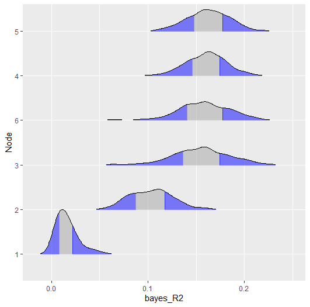
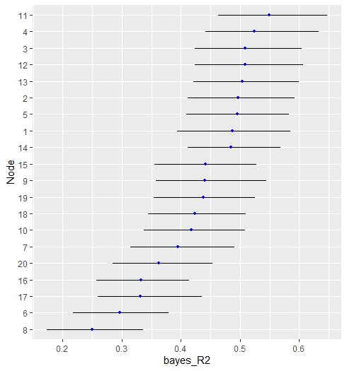

# Background
This vignette desribes a new feature to **BGGM** (`2.0.0`) that allows for 
computing network predictability for binary and ordinal data. Currently 
the available option is Bayesian $R^2$ [@gelman_r2_2019].


### R packages
```{r, eval = FALSE, message=FALSE}
# need the developmental version
if (!requireNamespace("remotes")) { 
  install.packages("remotes")   
}   

# install from github
remotes::install_github("donaldRwilliams/BGGM")
library(BGGM)
```

# Binary
The first example looks at Binary data, consisting of 1190 observations and six variable. The data are are called `women_math` and the variable descriptions are provided in **BGGM**.

The model is estimated with
```{r, eval=FALSE}
# binary data
Y <- women_math

# fit model
fit <- estimate(Y, type = "binary")
```

and then predictability is computed
```{r, eval=FALSE}
r2 <- predictability(fit)

# print
r2

#> BGGM: Bayesian Gaussian Graphical Models 
#> --- 
#> Metric: Bayes R2
#> Type: binary 
#> --- 
#> Estimates:
#> 
#>  Node Post.mean Post.sd Cred.lb Cred.ub
#>     1     0.016   0.012   0.002   0.046
#>     2     0.103   0.023   0.064   0.150
#>     3     0.155   0.030   0.092   0.210
#>     4     0.160   0.021   0.118   0.201
#>     5     0.162   0.022   0.118   0.202
#>     6     0.157   0.028   0.097   0.208
#> ---
```


There are then two options for plotting. The first is with error bars, denoting the credible interval (i.e., `cred`),
```{r, message=FALSE, eval=FALSE}
plot(r2,
     type = "error_bar",
     size = 4,
     cred = 0.90)
```


and the second is with a ridgeline plot
```{r, message=FALSE, eval=FALSE}
plot(r2,
     type = "ridgeline",
     cred = 0.50)
```



# Ordinal
In the following, the `ptsd` data is used (5-level Likert). The variable descriptions are provided in **BGGM**. This is based on the polychoric partial correlations and then $R^2$ is computed from the corresponding correlations. This is done for all of the approaches, due to the correspondence between the correlation matrix and multiple regression.

```{r, eval=FALSE}
Y <- ptsd

fit <- estimate(Y + 1, type = "ordinal")
```

The only change is switching type from `"binary` to `ordinal`. One important 
point is the `+ 1`. This is required because for the ordinal approach the first 
category must be 1 (in `ptsd` the first category is coded as 0).

```{r, eval=FALSE}
r2 <- predictability(fit)

# print 
r2 

#> BGGM: Bayesian Gaussian Graphical Models 
#> --- 
#> Metric: Bayes R2
#> Type: ordinal 
#> --- 
#> Estimates:
#> 
#>  Node Post.mean Post.sd Cred.lb Cred.ub
#>     1     0.487   0.049   0.394   0.585
#>     2     0.497   0.047   0.412   0.592
#>     3     0.509   0.047   0.423   0.605
#>     4     0.524   0.049   0.441   0.633
#>     5     0.495   0.047   0.409   0.583
#>     6     0.297   0.043   0.217   0.379
#>     7     0.395   0.045   0.314   0.491
#>     8     0.250   0.042   0.173   0.336
#>     9     0.440   0.048   0.358   0.545
#>    10     0.417   0.044   0.337   0.508
#>    11     0.549   0.048   0.463   0.648
#>    12     0.508   0.048   0.423   0.607
#>    13     0.504   0.047   0.421   0.600
#>    14     0.485   0.043   0.411   0.568
#>    15     0.442   0.045   0.355   0.528
#>    16     0.332   0.039   0.257   0.414
#>    17     0.331   0.045   0.259   0.436
#>    18     0.423   0.044   0.345   0.510
#>    19     0.438   0.044   0.354   0.525
#>    20     0.362   0.043   0.285   0.454
#> ---
```

Here is the `error_bar` plot.
```{r, eval=FALSE}
plot(r2)
```



Note that the plot can be futher honed in (e.g,. adding the variable names).

# Continuous
It is quite common to compute predictability assuming that the data are Gaussian. This can also be implemented in
**BGGM**.

```{r, eval=FALSE}
# fit model
fit <- estimate(Y)

# predictability
r2 <- predictability(fit)
```

`type` is missing which indicates that `continuous` is the default.

# Note
$R^2$ for binary and ordinal data is computed for the underlying latent variables. This is also the case
when `type = "mixed` (a semi-parametric copula).

# References
