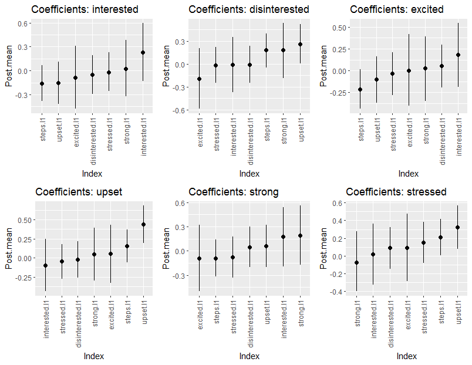
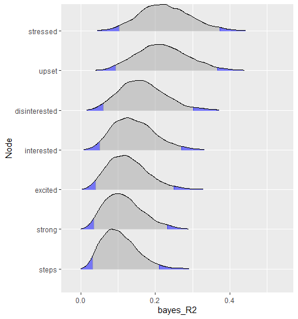

```{r setup, include=FALSE}
knitr::opts_chunk$set(echo = TRUE)
```

# Introduction
This vignette describes the implement ion for a "graphical VAR" in `BGGM`. In `BGGM`, this is fitted as a multivariate regression. The  key innovation is a novel prior distribution for the residual covariance matrix. There are a variety of much cooler names than a *mere* "multivariate regression", including "VAR" (vector autoregressive models) and "TSCGM" (time series chain graphical model).

## R package
```
# need the developmental version
if (!requireNamespace("remotes")) { 
  install.packages("remotes")   
}   

# install from github
remotes::install_github("donaldRwilliams/BGGM")
library(BGGM)

# for comparsion
library(vars)

# for plotting
library(qgraph)

# combine plots
library(cowplot)
```

## Data 
I use data from the ifit (fit bit) study. The data were gathered over 100 consecutive days on a variety of variables, including the PANAS scale (positive and negative affect) and the number of steps each day. `BGGM` includes a subset of variables for two individuals.

```r
# data
Y <- subset(ifit, id == 1)[,-1]

# first 3 rows
head(Y, n = 3)

#>  interested disinterested excited upset strong stressed steps
#>         72            10      50     2     50       16  7805
#>         75             6      75     0     76        0 18248
>#         36            58      38     5     45        1 12139
```


# Estimation 
The methods in **BGGM** are organized around Bayesian "estimation" and "hypothesis testing". This is to reach
a broader audience, as former is more similar to classical methods (those more familiar to researchers).

## Fit Model
With the data in hand, the model is fitted as follows

```
# fit model
fit <- var_estimate(Y, beta_sd = 1)
```
Note that `beta_sd` is the prior distribution for the regression coefficients. A smaller value, say, `beta_sd = 0.25`, results in a Bayesian ridge regression. Note also this model, including 5000 draws from the posterior,

The results can then be printed
```r
#> BGGM: Bayesian Gaussian Graphical Models 
#> --- 
#> Vector Autoregressive Model (VAR) 
#> --- 
#> Posterior Samples: 5000 
#> Observations (n): 94 
#> Nodes (p): 7 
#> --- 
#> Call: 
#> var_estimate(Y = Y, beta_sd = 10)
#> --- 
#> Partial Correlations: 
#> 
#>               interested disinterested excited  upset strong stressed  steps
#> interested         0.000        -0.170   0.388 -0.217  0.313    0.268  0.089
#> disinterested     -0.170         0.000  -0.172 -0.029  0.094    0.160 -0.078
#> excited            0.388        -0.172   0.000 -0.126  0.500   -0.161 -0.016
#> upset             -0.217        -0.029  -0.126  0.000  0.118    0.350 -0.039
#> strong             0.313         0.094   0.500  0.118  0.000   -0.010  0.176
#> stressed           0.268         0.160  -0.161  0.350 -0.010    0.000 -0.038
#> steps              0.089        -0.078  -0.016 -0.039  0.176   -0.038  0.000
#> --- 
#> Coefficients: 
#> 
#>                  interested disinterested excited  upset strong stressed  steps
#> interested.l1         0.230        -0.009   0.182 -0.102  0.178    0.018  0.113
#> disinterested.l1     -0.051        -0.007   0.056 -0.019  0.049    0.091 -0.023
#> excited.l1           -0.088        -0.196   0.003  0.057 -0.093    0.092  0.106
#> upset.l1             -0.155         0.262  -0.097  0.435  0.057    0.324 -0.091
#> strong.l1             0.026         0.182   0.026  0.048  0.189   -0.073 -0.196
#> stressed.l1          -0.021        -0.014  -0.033 -0.048 -0.079    0.152  0.133
#> steps.l1             -0.157         0.180  -0.211  0.155 -0.092    0.209  0.042
#> --- 
#> Date: Thu Jun 04 08:54:04 2020 
```

Note that the coefficients are comparable, given each variable has been standardized (e.g., the predictors
and the outcome are standardized). `BGGM` does not compute the partial directed correlation (PDC) by default (as in **graphicalVAR**). This is because the standardized effects can readily be tested with the Bayes factor, both across and within each model, whereas this does not seem straightforward for the PDC (which requires a transformation).

### Compare to Classical
Here are the estimates from the `vars` package

```r
t(round(
  vars::Bcoef( 
  vars:::VAR(scale(na.omit(Y)), type = "none")), 
  digits = 3)
)

#>                  interested disinterested excited  upset strong stressed  steps
#> interested.l1         0.229        -0.012   0.184 -0.100  0.180    0.015  0.112
#> disinterested.l1     -0.050        -0.006   0.057 -0.019  0.050    0.092 -0.022
#> excited.l1           -0.088        -0.193   0.002  0.056 -0.091    0.093  0.106
#> upset.l1             -0.155         0.260  -0.096  0.436  0.058    0.321 -0.092
#> strong.l1             0.027         0.182   0.025  0.047  0.188   -0.073 -0.192
#> stressed.l1          -0.021        -0.012  -0.033 -0.046 -0.077    0.152  0.133
#> steps.l1             -0.157         0.183  -0.210  0.153 -0.093    0.207  0.041
```

Recall that the "estimation" methods are similar to, in this case, ordinal least squares. The graphical structure in `BGGM` is determined with credible intervals, which will be quite similar to using confidence
intervals. Hence for those researchers unfamiliar with Bayesian methods the "estimation" methods are perhaps
a nice place to start.

## Summarize Model
The models can the be summarized with

```r
print(
  summary(fit,  cred = 0.95), 
  param = "pcor"
  )


#> BGGM: Bayesian Gaussian Graphical Models 
#> --- 
#> Vector Autoregressive Model (VAR) 
#> --- 
#> Partial Correlations: 
#> 
#>                   Relation Post.mean Post.sd Cred.lb Cred.ub
#>  interested--disinterested    -0.170   0.108  -0.382   0.044
#>        interested--excited     0.388   0.085   0.219   0.546
#>     disinterested--excited    -0.172   0.104  -0.369   0.049
#>          interested--upset    -0.217   0.106  -0.417   0.000
#>       disinterested--upset    -0.029   0.101  -0.239   0.161
#>             excited--upset    -0.126   0.098  -0.315   0.066
#>         interested--strong     0.313   0.090   0.135   0.480
#>      disinterested--strong     0.094   0.112  -0.120   0.318
#>            excited--strong     0.500   0.078   0.337   0.645
#>              upset--strong     0.118   0.109  -0.100   0.325
#>       interested--stressed     0.268   0.102   0.058   0.460
#>    disinterested--stressed     0.160   0.100  -0.049   0.351
#>          excited--stressed    -0.161   0.099  -0.358   0.031
#>            upset--stressed     0.350   0.091   0.166   0.519
#>           strong--stressed    -0.010   0.107  -0.212   0.201
#>          interested--steps     0.089   0.108  -0.123   0.297
#>       disinterested--steps    -0.078   0.108  -0.284   0.125
#>             excited--steps    -0.016   0.100  -0.207   0.182
#>               upset--steps    -0.039   0.107  -0.245   0.178
#>              strong--steps     0.176   0.101  -0.024   0.364
#>            stressed--steps    -0.038   0.108  -0.236   0.193
#> --- 
```

The coefficients can also be printed by changing `param` to either `all` or `beta`, The summary can also be plotted. Here are the coefficients

```r
plts <- plot(summary(fit,  cred = 0.95))

cowplot::plot_grid(
  cowplot::plot_grid(
                   plts$beta_plt$interested, 
                   plts$beta_plt$disinterested, 
                   plts$beta_plt$excited, nrow = 1),
cowplot::plot_grid(  
                   plts$beta_plt$upset,
                   plts$beta_plt$strong,
                   plts$beta_plt$stressed,nrow = 1
                  ), nrow = 2)
```



There is also a plot for the partial correlations.

## Select Graph
The graphs are selected with 

```r
select(fit, cred = 0.95)

#> BGGM: Bayesian Gaussian Graphical Models 
#> --- 
#> Vector Autoregressive Model (VAR) 
#> --- 
#> Posterior Samples: 5000 
#> Credible Interval: 95 % 
#> --- 
#> Call: 
#> var_estimate(Y = Y, beta_sd = 10)
#> --- 
#> Partial Correlations: 
#> 
#>               interested disinterested excited  upset strong stressed steps
#> interested         0.000             0   0.388 -0.217  0.313    0.268     0
#> disinterested      0.000             0   0.000  0.000  0.000    0.000     0
#> excited            0.388             0   0.000  0.000  0.500    0.000     0
#> upset             -0.217             0   0.000  0.000  0.000    0.350     0
#> strong             0.313             0   0.500  0.000  0.000    0.000     0
#> stressed           0.268             0   0.000  0.350  0.000    0.000     0
#> steps              0.000             0   0.000  0.000  0.000    0.000     0
#> --- 
#> Coefficients: 
#> 
#>                  interested disinterested excited upset strong stressed steps
#> interested.l1             0         0.000       0 0.000      0    0.000     0
#> disinterested.l1          0         0.000       0 0.000      0    0.000     0
#> excited.l1                0         0.000       0 0.000      0    0.000     0
#> upset.l1                  0         0.262       0 0.435      0    0.324     0
#> strong.l1                 0         0.000       0 0.000      0    0.000     0
#> stressed.l1               0         0.000       0 0.000      0    0.000     0
#> steps.l1                  0         0.000       0 0.000      0    0.209     0
#> --- 

```


# Plot Graph
For plotting, I use the **qgraph** package.

```r
par(mfrow=c(1,2))
qgraph::qgraph(sel$pcor_weighted_adj, title = "Partials")
qgraph::qgraph(sel$beta_weighted_adj, title = "Coefficients")
```


# Predictability
Finally, it is also possible to compute and plot predictability, in this case Bayesian $R^2$

```
r2 <- predictability(fit)

plot(r2, type = "ridgeline")
```



# Explore
Bayesian (exploratory) testing to come...
# Confirm

Bayesian (confirmatory) testing to come...
# Note
